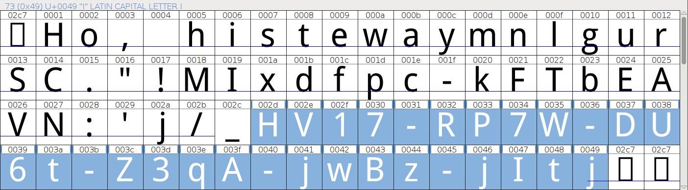

# Day 04: HoHoHo

*NOTE: New easyfied attachment available*

Santa has hidden something for you [here](files/HoHoHo.pdf "HoHoHo.pdf")

### Solution

Let's extract files from given PDF using binwalk and see what's inside.

```
$ binwalk -e HoHoHo.pdf 

DECIMAL       HEXADECIMAL     DESCRIPTION
--------------------------------------------------------------------------------
0             0x0             PDF document, version: "1.4"
1673          0x689           Zlib compressed data, default compression
3339          0xD0B           Zlib compressed data, default compression
21066         0x524A          Zlib compressed data, default compression
22108         0x565C          Zlib compressed data, default compression
32480         0x7EE0          Zlib compressed data, default compression

$ file _HoHoHo.pdf.extracted/* | grep -v zlib
_HoHoHo.pdf.extracted/D0B:       data
_HoHoHo.pdf.extracted/524A:      data
_HoHoHo.pdf.extracted/565C:      TrueType Font data, 12 tables, 1st "cmap", 30 names, Macintosh, Digitized data copyright \251 2007, Google Corporation.Droid Sans RegularRegularFontForge 2.0 : 
_HoHoHo.pdf.extracted/689:       ASCII text, with very long lines
_HoHoHo.pdf.extracted/7EE0:      ASCII text
```

The most interesting file is [565C](files/565C.ttf "565C.ttf"), identified as a TrueType font. Let's try to open it with FontForge which is mentioned in its description.



Now we can see the flag hidden inside.

```
HV17-RP7W-DU6t-Z3qA-jwBz-jItj
```