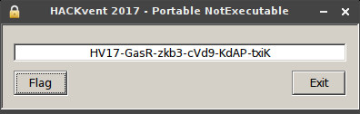
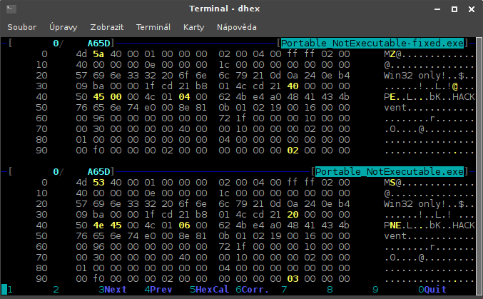
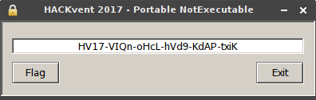

# Day 17: Portable NotExecutable

Here is your flag.

But wait - its not running, because it uses the new Portable NotExecutable Format. This runs only on Santas PC. Can you fix that?

[Get the flag here](files/Portable_NotExecutable.zip "Portable_NotExecutable.zip")

Hint #1: IMAGE_FILE_HEADER and its friends  
Hint #2: No reversing/bruteforcing needed. Just make it run ...   
Hint #3: take the hint in the file serious, the black window should not appear (wine and cmd users might not see it - change OS or how you run the exe)

### Solution

Let's unzip it and take a look.

```bash
$ unzip Portable_NotExecutable.zip 
Archive:  Portable_NotExecutable.zip
  inflating: Portable_NotExecutable.exe
$ file Portable_NotExecutable.exe 
Portable_NotExecutable.exe: data
$ strings Portable_NotExecutable.exe | grep "HV17-"
HV17-GasR-zkb3-cVd9-KdAP-txi is almost good. but why the black window?
```

Hmm, there's a hint hidden at the end of file. Interesting. Doesn't make sense to me at this point but I'm sure it will be useful later. Now it's time to fix file headers. I know from the title that it's a Portable Executable. I found this [document](files/PE_Format_Walkthrough.pdf "PE_Format_Walkthrough.pdf") about PE headers which helped me a lot.

The first thing to fix was the `e_magic` in the DOS header from `4d 53` to `4d 5a` using hexedit. Now the file was already recognized, but it still cannot be run. There are more things to fix.

```bash
$ file Portable_NotExecutable-fixed.exe 
Portable_NotExecutable-fixed.exe: MS-DOS executable, MZ for MS-DOS
$ wine Portable_NotExecutable-fixed.exe 
winevdm: Cannot start DOS application Z:\tmp\17\Portable_NotExecutable-fixed.exe
         because the DOS memory range is unavailable.
         You should install DOSBox.
```

So I continued with the DOS header. There was one more thing to fix - the offset where to find NT header stored in the `e_lfanew` had to be changed from `20 00 00 00` to `40 00 00 00`.

The NT header needed some fixes too. Signature had to be changed to the right value `50 45 00 00` and then number of sections had to be changed to `04 00`. At this point I was able to run the fixed version of given program under wine and get the "almost good" flag mentioned in the hidden hint.



Then I got completely lost with the hidden hint. Black window didn't make sense to me since I was trying it under wine. After the third hint was published I finally got it. It was the Windows commandline window!

The last thing I had to change was subsystem -  from `03` (Windows CUI) to `02` (Windows GUI).

The final [fixed version](files/Portable_NotExecutable-fixed.exe "Portable_NotExecutable-fixed.exe") looks like this:

```bash
$ objdump -x -D Portable_NotExecutable-fixed.exe

Portable_NotExecutable-fixed.exe:     file format pei-i386
Portable_NotExecutable-fixed.exe
architecture: i386, flags 0x0000011b:
HAS_RELOC, EXEC_P, HAS_DEBUG, HAS_SYMS, D_PAGED
start address 0x00401f72

Characteristics 0x818e
	executable
	line numbers stripped
	symbols stripped
	little endian
	32 bit words
	big endian

Time/Date		Fri Jul 16 04:01:06 2055
Magic			010b	(PE32)
MajorLinkerVersion	2
MinorLinkerVersion	25
SizeOfCode		00001600
SizeOfInitializedData	00009600
SizeOfUninitializedData	00000000
AddressOfEntryPoint	00001f72
BaseOfCode		00001000
BaseOfData		00003000
ImageBase		00400000
SectionAlignment	00001000
FileAlignment		00000200
MajorOSystemVersion	1
MinorOSystemVersion	0
MajorImageVersion	0
MinorImageVersion	0
MajorSubsystemVersion	4
MinorSubsystemVersion	0
Win32Version		00000000
SizeOfImage		0000f000
SizeOfHeaders		00000200
CheckSum		00000000
Subsystem		00000002	(Windows GUI)
DllCharacteristics	00000000
SizeOfStackReserve	00100000
SizeOfStackCommit	00002000
SizeOfHeapReserve	00100000
SizeOfHeapCommit	00001000
LoaderFlags		00000000
NumberOfRvaAndSizes	00000010
```

This is hexadecimal diff of the original and the fixed version.



And this is the output of the fixed version of executable.



The result flag:

```
HV17-VIQn-oHcL-hVd9-KdAP-txiK
```