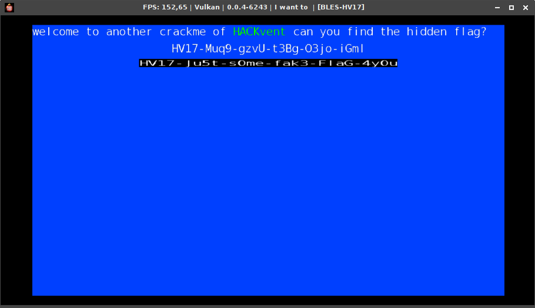
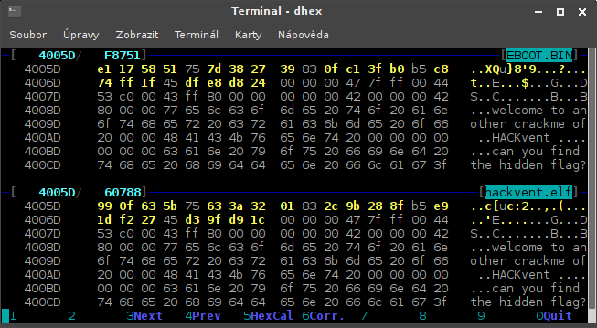
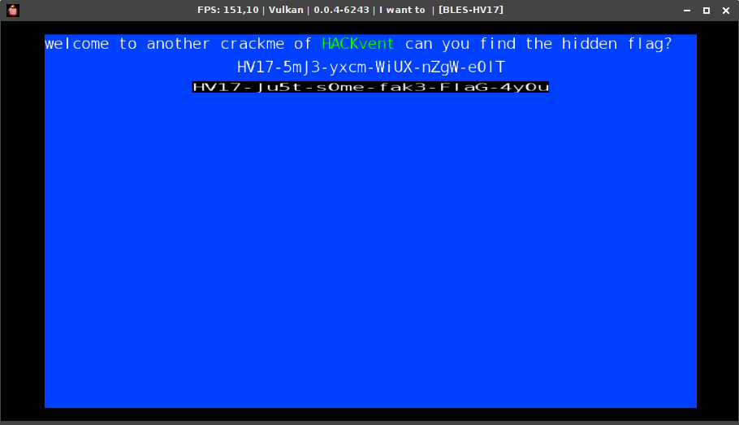

# Day 18: I want to play a Game (Reloaded)

Last year we played some funny games together - do you remember? Ready for another round?

Download the game here and play until you find the flag.

[Get the game](files/BLES-HV17.iso "BLES-HV17.iso")

Hint: Follow the fake flag in the unsigned binary. This challenge needs RE.

### Solution

Let's mount the iso and see what's inside.

```bash
$ mkdir iso
$ sudo mount -o loop BLES-HV17.iso iso
$ find iso -type f -exec file {} \;
iso/ICON0.PNG: PNG image data, 254 x 256, 8-bit/color RGBA, non-interlaced
iso/PARAM.SFO: data
iso/USRDIR/EBOOT.BIN: ELF 64-bit MSB executable, 64-bit PowerPC or cisco 7500, version 1 (SYSV), statically linked, with debug_info, not stripped
iso/USRDIR/hackvent.self: data
```

It looks like a PlayStation 3 game so I decided to download [rpcs3](https://rpcs3.net/) emulator and give it a try. There were some problems with the emulator but after switching renderer to Vulkan I managed to run [hackvent.self](files/iso/USRDIR/hackvent.self).



A blue screen with some fake flag appeared. I didn't expect this should be the real flag because it would be too easy but I tried to submit it anyway. And it worth it - it was the second hidden flag!

The hidden flag:

```
HV17-Muq9-gzvU-t3Bg-O3jo-iGml
```

Then I tried to run the second binary - [EBOOT.BIN](files/iso/USRDIR/EBOOT.BIN) but I got this error:

```
F {PPU[0x1000000] Thread (main_thread) [0x00057620]} St13runtime_error thrown: Unregistered PPU function
```

I decided to go back to the [hackvent.self](files/iso/USRDIR/hackvent.self) and try to find a way how to decrypt it. Eventually I found a tool named *TrueAncestor SELF Resigner* which did the job and I got decrypted [hackvent.elf](files/iso/USRDIR/hackvent.elf).

I got stuck without any idea for a while. Then I tried to do hex diff of EBOOT.BIN and hackvent.elf. Despite different size the content looked very similar from the beginning. I followed differences until I found very interesting one. There were 5 groups starting at offset `0x4005d`. Each was 4 bytes long with 1 byte between adjacent groups. It looked suspiciously similar to a diff of two flags of standard format and it was next to the fake flag in the binary. It definitely was worth a try.



I decided to patch hackvent.elf with those 5 groups from EBOOT.BIN and loaded this [patched version](files/iso/USRDIR/hackvent-patched.elf) into the emulator.



The result flag:

```
HV17-5mJ3-yxcm-WiUX-nZgW-e0lT
```