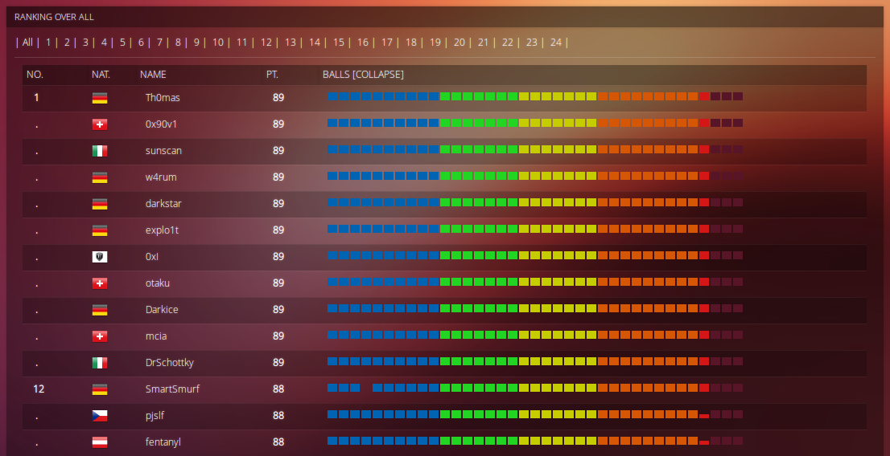

# HACKvent 2018 write-up by pjslf

#### Ranking

This year's HACKvent was really challenging. It started with ten teaser challenges including the xenon reverse to warm up properly at the very beginning. Then there were three hidden challenges and usual 24 daily challenges, but this time with muffinX's A&D CTF right before the Christmas Eve!

I didn't have much time at the end of this advent so I'm very happy that I lost only one point for late submission of the last daily challenge. Finally, I ended up in 12th place with 88 points out of 89 possible.

Congrats to all perfect solvers and scorers!

#### Teaser challenges

[Day -10: Dots](teaser/day-10/README.md)  
[Day -09: Sneaky Morse](teaser/day-09/README.md)  
[Day -08: Stereogram](teaser/day-08/README.md)  
[Day -07: QR3C.png](teaser/day-07/README.md)  
[Day -06: Santa.txt](teaser/day-06/README.md)  
[Day -05: Teaser.pls](teaser/day-05/README.md)  
[Day -04: Old_School.jpg](teaser/day-04/README.md)  
[Day -03: Quickresponse.txt](teaser/day-03/README.md)  
[Day -02: Final.zip](teaser/day-02/README.md)  
[Day -01: Xenon.elf](teaser/day-01/README.md)  

#### Daily challenges

[Day 01: Just Another Bar Code](challenges/day01/README.md)  
[Day 02: Me](challenges/day02/README.md)  
[Day 03: Catch me](challenges/day03/README.md)  
[Day 04: Pirating like in the 90ies](challenges/day04/README.md)  
[Day 05: OSINT 1](challenges/day05/README.md)  
[Day 06: Mondrian](challenges/day06/README.md)  
[Day 07: Flappy.pl](challenges/day07/README.md)  
[Day 08: Advent Snail](challenges/day08/README.md)  
[Day 09: Fake xmass balls](challenges/day09/README.md)  
[Day 10: >_ Run, Node, Run](challenges/day10/README.md)  
[Day 11: Crypt-o-Math 3.0](challenges/day11/README.md)  
[Day 12: SmartWishList](challenges/day12/README.md)  
[Day 13: Flappy's revenge](challenges/day13/README.md)  
[Day 14: Power in the shell](challenges/day14/README.md)  
[Day 15: Watch Me](challenges/day15/README.md)  
[Day 16: Pay 100 Bitcoins](challenges/day16/README.md)  
[Day 17: Faster Key Exchange](challenges/day17/README.md)  
[Day 18: Be Evil](challenges/day18/README.md)  
[Day 19: PromoCode](challenges/day19/README.md)  
[Day 20: I want to play a game](challenges/day20/README.md)  
[Day 21: MuffinCTF #1](challenges/day21/README.md)  
[Day 22: MuffinCTF #2](challenges/day22/README.md)  
[Day 23: MuffinCTF #3](challenges/day23/README.md)  
[Day 24: Take the red pill, take the blue pill](challenges/day24/README.md)  

#### Hidden challenges

[Hidden 01](challenges/hidden01/README.md)  
[Hidden 02](challenges/hidden02/README.md)  
[Hidden 03](challenges/hidden03/README.md)  
