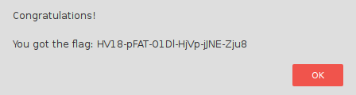

# Day 03: Catch me

*... if you can*

To get the flag, just press the button

[Catch me!](https://hackvent.hacking-lab.com/C4tchM3_dizzle/)

### Description

The provided button brought you to a page with a single button `Get the flag` which moved to another location when you tried to click it.

### Solution

Solution was pretty simple using jQuery. First I looked up the button element id and then ran this snippet in browser's console.

```javascript
$('#button').click()
```

It clicked the button for me and revealed an alert window with flag in it.



```
HV18-pFAT-O1Dl-HjVp-jJNE-Zju8
```
