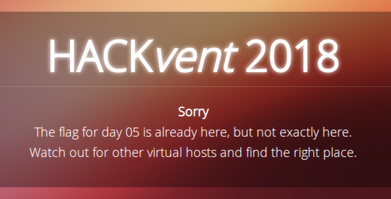
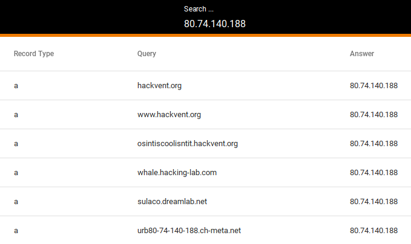

# Day 05: OSINT 1

*It's all about transparency*

Santa has hidden your daily present on his server, somewhere on port 443.

Start on [https://www.hackvent.org](https://www.hackvent.org) and follow the OSINT traces.

### Description

This is how the website looked like



### Solution

To find the right virtual host I decided to lookup up all other domain names of `80.74.140.188` using [passive DNS](http://techgenix.com/what-passive-dns/), namely this great [tool](https://passivedns.mnemonic.no/).



One domain immediately took my attention: `osintiscoolisntit.hackvent.org`

After loading the [website]((https://osintiscoolisntit.hackvent.org/)) i got the flag.


```
HV18-0Sin-tI5S-R34l-lyC0-oo0L
```
