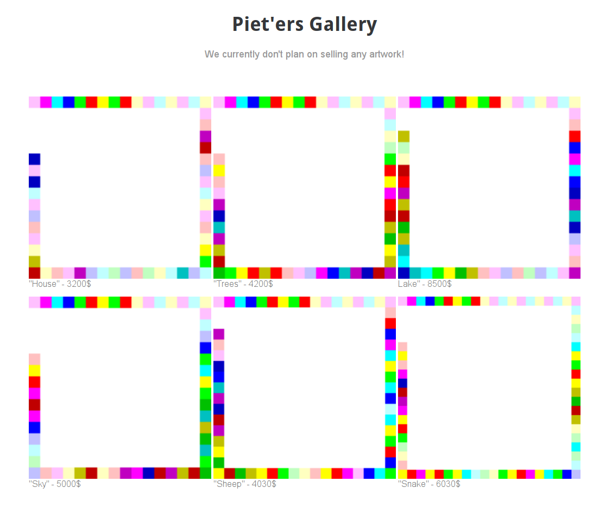

# Day 06: Mondrian

Piet'er just opened his gallery to present his pieces to you, they'd make for a great present :)

[Open gallery!](https://hackvent.hacking-lab.com/Mondrian-Gallery/)

### Description

This is how the gallery looked like.



### Solution

Since I know Piet Mondrian was famous Dutch painter and the images in gallery reminded me a 2D code I started searching for "Piet Mondrian color code". Just before I gave up browsing search results pages I discovered [this page](http://www.dangermouse.net/esoteric/piet.html) about an esoteric, stack oriented, programming language called Piet which looked like a perfect match. Programs written in it look like abstract paintings.

Then I used Piet [interpreter](https://www.bertnase.de/npiet/npiet-execute.php) I found online to execute those programs from gallery.


> HV18


> M4ke


> S0m3


> R3Al


> N1c3


> artZ

The final step was to join all the parts together.

```
HV18-M4ke-S0m3-R3Al-N1c3-artZ
```
