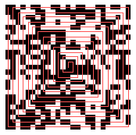

# Day 08: Advent Snail

In Cyberstan there is a big tradition to backe advents snails during advent.


### Solution

2D code on the Xmas ball looked like a scrambled QR code or Data Matrix. I spent few minutes searching for a *snail cipher* and quickly realized what had to be done.

The key to this challenge was the shape of a snail shell – a spiral path which showed me how to rearrange pixels of the code in order to decode it.



I was too lazy to do it manually so I started to write a Scala program to decode it for me.

This is the function responsible for converting the image to a text representation of its pixels.

```scala
def readCode(image: BufferedImage): Code = {
  val pixels = Array.ofDim[Boolean](qrCodeSize, qrCodeSize)
  for (y <- 0 until qrCodeSize) {
    for (x <- 0 until qrCodeSize) {
      val posx = qrPixelCenterOffset + x * qrPixelSize
      val posy = qrPixelCenterOffset + y * qrPixelSize
      val rgb = image.getRGB(posx, posy)
      pixels(y)(x) = rgb == Color.BLACK.getRGB
    }
  }
  pixels
}
```

Then it was time to implement the spiral decoding. I started with the ambition to implement this algorithm myself, but then I changed my mind. It was already late at night and I wanted to go to bed so I decided to use an implementation available on [dcode.fr](https://www.dcode.fr/spiral-cipher) to save some time.

Here is the function which calls dcode.fr remote API to decode the code with all 8 outward variants of snail orientations.

```scala
def decodeCode(code: Code): Seq[Code] = {
  val http = HttpClients.createDefault()
  try {
    val ciphertext = code.map(line => line.map(if (_) '1' else '0').mkString).mkString

    val form = new util.ArrayList[BasicNameValuePair]
    form.add(new BasicNameValuePair("tool", "spiral-cipher"))
    form.add(new BasicNameValuePair("ciphertext", ciphertext))
    form.add(new BasicNameValuePair("writing_mode", "outward"))
    form.add(new BasicNameValuePair("punctuation", "1"))

    val req = new HttpPost("https://www.dcode.fr/api/")
    req.setEntity(new UrlEncodedFormEntity(form, Consts.UTF_8))

    val resp = http.execute(req, new BasicResponseHandler()).parseJson.convertTo[Response]
    val plaintexts = resp.results.values.toList

    plaintexts.map(_.grouped(qrCodeSize).map(_.map(_ == '1').toArray).toArray)
  } finally {
    http.close()
  }
}
```

Now it was time to put it together.

```scala
val image = loadImage(Paths.get("hackvent2018/challenges/day08/files/4dv3ntSn4il-crop.png"))
assert(image.getWidth == image.getHeight)

val qrCodeSize = 25
val qrPixelSize = image.getWidth / qrCodeSize
val qrPixelCenterOffset = qrPixelSize / 2

val encoded = readCode(image)
val decoded = decodeCode(encoded)

val solution = decoded.find(c => (c(0).slice(0, 7) ++ c(0).slice(qrCodeSize - 7, qrCodeSize)).forall(_ == true))
solution.foreach(displayCode)
```

Complete source code can be found [here](../../src/main/scala/hackvent2018/Day08.scala). It worked like a charm.

Here is the console output:

```
██████████████    ██        ████    ██████████████
██          ██  ████  ██████  ████  ██          ██
██  ██████  ██    ██████    ██      ██  ██████  ██
██  ██████  ██  ████  ██      ████  ██  ██████  ██
██  ██████  ██      ██  ██████████  ██  ██████  ██
██          ██  ██  ██      ██████  ██          ██
██████████████  ██  ██  ██  ██  ██  ██████████████
                        ████                      
██████████  ██████████  ██        ██  ██  ██  ██  
  ██            ████      ██  ████████  ██    ██  
      ██████████  ██  ████  ████      ████      ██
██    ██  ██    ████████      ██████    ██      ██
██      ██████  ████  ████            ██    ██  ██
██        ██    ██  ██  ████  ████  ████          
██  ████    ██    ██    ████  ██          ██    ██
██  ██    ██    ██  ██  ██  ████████  ██  ██    ██
██  ██    ████          ██  ██  ██████████  ██    
                ██  ██      ██████      ████    ██
██████████████  ██            ████  ██  ██████████
██          ██          ████  ████      ████  ████
██  ██████  ██  ██  ████      ████████████  ██  ██
██  ██████  ██  ████    ████  ██  ████    ████  ██
██  ██████  ██  ██    ██    ████  ████    ████  ██
██          ██  ██    ████          ████  ████  ██
██████████████  ████  ██    ████    ██  ██    ████
```

And the result flag:

```
HV18-$$nn-@@11-LLr0-B1ne
```
