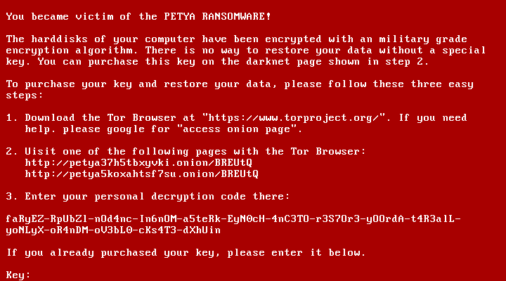

# Day 16: Pay 100 Bitcoins

*... or find the flag*

It changed the host. Fortunately it doesn't do the full job ... so there's hope. Get the things straight again and find the flag.

The OS is encrypted, but you know the key: **IWillNeverGetAVirus**

Download the image here: [local download link](files/HACKvent_thx_awesome_1n1k.ova) or here: [external download link](https://drive.google.com/file/d/1v70Z6ZLA1F39Zrb39X2zoLzQn7-LPche/view?usp=sharing) 

### Description

When you booted up the image in VirtualBox you ended up with this red screen informing you that you became victim of the PETYA ransomware.



### Solution

In order to find the flag I decided to mount and explore disc partitions first. To do so I downloaded bootable ISO of 32bit version of [Slax](https://www.slax.org/) distribution, mounted it as the optical drive of my virtual machine and booted it up.

I found two partition in total.

```
# lsblk -f /dev/sda
NAME   FSTYPE      LABEL UUID                                 MOUNTPOINT
sda                                                           
├─sda1 ext4              d7356b33-5e82-44ca-9727-fbd2574ab573 /media/sda1
└─sda2 crypto_LUKS       fbce3d2a-5636-45da-aca6-e631916e2bce
```

The first one didn't contain anything interesting so I quickly moved to the second one. I followed [this tutorial](https://blog.sleeplessbeastie.eu/2015/11/16/how-to-mount-encrypted-lvm-logical-volume/) describing how to mount an encrypted LVM logical volume.

```
# file -s /dev/sda2
/dev/sda2: LUKS encrypted file, ver 1 [aes, xts-plain64, sha256] UUID: fbce3d2a-5636-45da-aca6-e631916e2bce
```

I had to install some packages first to be able to work with such volume.

```
# apt install cryptsetup lvm2
``` 

Then I mounted the LVM volume using following commands.

```
# cryptsetup luksOpen /dev/sda2 encrypted_device
Enter passphrase for /dev/sda2:
# vgdisplay --short
  "vg0" 88.00 MiB [88.00 MiB used / 0    free]
# lvs -o lv_name,lv_size -S vg_name=vg0
  LV   LSize 
  root 88.00m
# lvchange -ay vg0/root
# mount /dev/vg0/root /media/sda2/
```

Now the fun part begun. It took me a while to find the [.ash_history](files/.ash_history) file in root's home directory. It contained this clue.

```
vi /etc/motd
```

So I simply opened that [motd](files/motd) file and got this.

```
Congratulation, you did it!

  o______
  |\\-//|
  |//-\\|
  |~~~~~~
  |
  |
  |

Your flag is HV18-622q-gxxe-CGni-X4fT-wQKw
```
