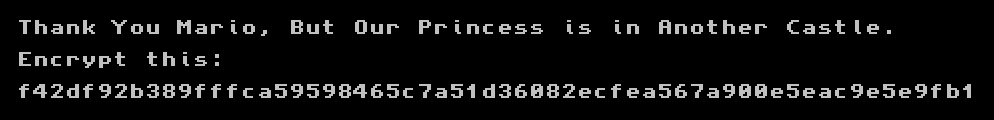

# Day 20: I want to play a game

Santa didn't forget about the games this year! Ready to play?

Get your game [here](files/HaRdvent.nro).

### Solution

This year it was a game for [Nintendo Switch](https://en.wikipedia.org/wiki/Nintendo_Switch) console which used the [NRO](https://switchbrew.org/wiki/NRO) format.

I successfully ran it in [yuzu emulator](https://yuzu-emu.org/). The game only displayed this static screen.



The instructions were clear. Now it was time to get some proper tools for this job. I downloaded [Nintendo Switch Binary Loader for IDA](https://github.com/pgarba/SwitchIDAProLoader) which allowed me to decompile the binary. Here is the [relevant part](files/HaRdvent.c) of the decompiled code.

I found one unusual string which immediately caught my attention: `shuffle*whip$crush%squeeze`. I put it into Google which directed me to the [Spritz cipher](http://people.csail.mit.edu/rivest/pubs/RS14.pdf). What a good start...

Now the functions in the decompiled C code began to make much more sense to me. I was able to recognize `sub_6E0` as the Spritz [decrypt function](https://github.com/cuhsat/spritz.c/blob/master/spritz.c#L142) with `shuffle*whip$crush%squeeze` used as the key.

```c
  strcpy(&v19, "shuffle*whip$crush%squeeze");                // v19 = key
  sub_10580((__int64)&v20, (__int64 *)&unk_26000, 0x98uLL);  // v20 = ciphertext
  sub_6E0((__int64)&v19, 27LL, (__int64)&v20, 152LL);        // decrypt(key, 27, ciphertext, 152)
```

To get the flag I wrote a short [script](../../src/main/python/hackvent2018/Day20.py) based on this Spritz [implementation](https://github.com/edwardcunningham/spritz) in Python which simply decrypted the displayed hexed string using the same key.

```python
spritz = Spritz()

K = bytearray(b'shuffle*whip$crush%squeeze\0')
M = bytearray.fromhex('f42df92b389fffca59598465c7a51d36082ecfea567a900e5eac9e5e9fb1')
C = spritz.encrypt(K, M)

print("flag: " + C.decode("utf-8"))
```

Here is the flag:

```
HV18-Wl8b-jSu3-TtHY-ziO4-5ikM
```
