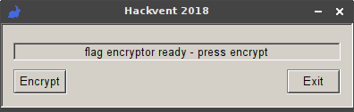

# Day 24: Take the red pill, take the blue pill

Have you already taken your vitamins today? Here are some pills for your health.

[red pill](files/redpill.zip) | [blue pill](files/bluepill.zip)

**Hint:**

It might take a minute or two until the blue pill shows its effect. Blue pill manufactury is in GMT+1.  

[hint](files/hint.mp3)

### Solution

This challenge consisted of two complementary parts - the blue pill and the red pill - which had to be combined together to get the flag.

##### Blue pill

The blue pill archive contained a PE32 executable and the binary file of encrypted flag.

```
$ unzip bluepill.zip 
Archive:  bluepill.zip
  inflating: bluepill.exe            
  inflating: flag_encrypted
$ file bluepill.exe 
bluepill.exe: PE32 executable (GUI) Intel 80386, for MS Windows
```

I ran the exe file under Wine. It showed me this simple dialog window from which I could initiate encryption of a flag file. However it was somehow picky about the file format. I tried a random text file which resulted in `error: this flag is not allowed`. 



I decided to look under the bonnet and decompiled the binary in IDA. This is the most relevant part of the decompiled [source code]((files/bluepill/bluepill.c)).

```c
hFile = v4;                                                   // flag file handle
dwBytes = GetFileSize(v4, 0);
if ( dwBytes % 2 ) ++dwBytes;
dword_402270 = GlobalAlloc(0x40u, dwBytes);
hMem = GlobalLock(dword_402270);
v5 = hMem;
ReadFile(hFile, hMem, dwBytes, &NumberOfBytesRead, 0);        // read flag into v5
CloseHandle(hFile);
if ( *v5 == 0x474E5089 ) {                                    // check against PNG magic number
  nNumberOfBytesToWrite = dwBytes >> 1;
  v6 = GlobalAlloc(0x40u, dwBytes >> 1);
  dword_402278 = v6;
  v7 = GlobalLock(v6);
  lpBuffer = v7;
  v8 = 0;
  v9 = hMem;
  while ( v8 != nNumberOfBytesToWrite ) {                     // take only high half-bytes of flag
    *((_BYTE *)v7 + v8) = (v9[2 * v8 + 1] >> 4) | 16 * (v9[2 * v8] >> 4);
    ++v8;                                                     // combine each two of them into a single byte
  }                                                           // and store the result bytes into lpBuffer
  GlobalUnlock(hMem);
  GlobalFree(dword_402270);
  sub_4019F8();                                               // get current FILETIME and store it into FileTime
  sub_4013D7((int)&unk_4020D1, (unsigned int *)&unk_402171);  // setup hardcoded key
  sub_40121D((int)&unk_4020D1, (int *)&FileTime);             // setup initial vector from FileTime
  sub_401000(&unk_4020D1, lpBuffer, nNumberOfBytesToWrite);   // crypt stripped flag stored in lpBuffer using Rabbit cipher
  v10 = CreateFileA(aFlagEncrypted, 0xC0000000, 3u, 0, 2u, 0, 0);
  if ( v10 == (HANDLE)-1 ) {                                  // encrypted flag file handle
    SetDlgItemTextA(hWndParent, 2000, aErrorCouldNotW);
  } else {
    dword_402290 = v10;                                       // write encrypted flag to file
    if ( WriteFile(v10, lpBuffer, nNumberOfBytesToWrite, &NumberOfBytesRead, 0) )
      SetDlgItemTextA(hWndParent, 2000, aSuccessFlagEnc);
  }
}
```

With the hint of the blue rabbit icon and the number constants used in [sub_40121D](files/bluepill/bluepill.c#L202) function I found out that the [Rabbit cipher](https://en.wikipedia.org/wiki/Rabbit_%28cipher%29) was used inside. The encryption key was hardcoded in the binary and the initial vector was taken from the current timestamp in the [FILETIME](https://msdn.microsoft.com/en-us/library/windows/desktop/ms724284(v=vs.85).aspx) format.

Now I had all the necessary information to perform my brute force attack to decrypt the high half-bytes part of the flag. The key was known, I had upper bound of the initial vector equal to the creation date of the `encrypted_flag` file and I knew that the right initial vector had to encrypt the PNG magic number `0x474E5089` to the the first 4 bytes of given encrypted flag.

I implemented the blue pill in Scala and added the necessary stuff to crack the initial vector. It cracked it pretty fast as expected.

```scala
object BluePill {

  private val key = Array(0x87, 0x05, 0x89, 0xCD, 0xA8, 0x75, 0x62, 0xEF, 0x38, 0x45, 0xFF, 0xD1, 0x41, 0x37, 0x54, 0xD5).map(_.toByte)

  def crackIV(encfile: String): Array[Byte] = {
    val expected = loadBytes(encfile).slice(0, 4)
    def generateIV(t: Long): Array[Byte] = BigInt(t).toByteArray.reverse

    Stream.iterate(filetime(encfile))(_ - 10000).find(t => {
      val iv = BigInt(t).toByteArray.reverse
      val encrypted = encrypt(pngMagicNum, iv)
      encrypted.sameElements(expected)
    }).map(generateIV).get
  }

  def encrypt(data: Array[Byte], iv: Array[Byte]): Array[Byte] = crypt(encode(data), iv)
  def decrypt(data: Array[Byte], iv: Array[Byte]): Array[Byte] = decode(crypt(data, iv))

  def crypt(encoded: Array[Byte], iv: Array[Byte]): Array[Byte] = rabbitCrypt(encoded, iv, key)

  def encode(msg: Array[Byte]): Array[Byte] = {
    val encoded = new Array[Byte]((msg.length + 1) / 2)
    for (i <- encoded.indices) {
      encoded(i) = (msg(2 * i) & 0xF0 | msg(2 * i + 1) >> 4).toByte
    }
    encoded
  }

  def decode(msg: Array[Byte]): Array[Byte] = {
    val decoded = new Array[Byte](msg.length * 2)
    for (i <- msg.indices) {
      decoded(2 * i) = (msg(i) & 0xF0).toByte
      decoded(2 * i + 1) = (msg(i) << 4).toByte
    }
    decoded
  }

  def filetime(file: String): Long = {
    val FILETIME_EPOCH_DIFF = 11644473600000L
    val FILETIME_ONE_MILLISECOND = 10 * 1000
    val createdMillis = Files.readAttributes(Paths.get(file), classOf[BasicFileAttributes]).creationTime().toMillis
    (createdMillis + FILETIME_EPOCH_DIFF) * FILETIME_ONE_MILLISECOND
  }

}
```

##### Red pill

The red pill archive contained a JAR file and the binary file of encrypted flag.

```
$ unzip redpill.zip 
Archive:  redpill.zip
 extracting: flag_encrypted          
  inflating: redpill.jar
```

I decompiled the JAR which gave me two classes:
- [Cipher3.java](../../src/main/java/hackvent2018/day24/Cipher3.java) - Java implementation of the Rabbit cipher
- [RedPill.java](../../src/main/java/hackvent2018/day24/RedPill.java) - Blue pill's counterpart

Quick look at the red pill's source code revealed the differences from the blue pill.

```java
if (args.length != 1) {
    System.out.println("java -jar redpill.jar <red pill serial number> \n");
    System.exit(0);
}

if (!args[0].matches("[0-9]{2}-[0-9]{3}-[0-9]{3}")) {
    System.out.println("That's not a red pill");
    System.exit(0);
}

byte[] iv = args[0].replace("-", "").getBytes();
byte[] k = new byte[16];
System.arraycopy(iv, 0, k, 0, 8);
System.arraycopy(iv, 0, k, 8, 8);
byte[] b = Files.readAllBytes((new File("flag")).toPath());
byte[] f = new byte[(b.length + 1) / 2];

for (int i = 0; i < b.length; ++i) {
    if (i % 2 == 0) {
        f[i / 2] = (byte) (f[i / 2] | b[i] << 4);
    } else {
        f[i / 2] = (byte) (f[i / 2] | b[i] & 15);
    }
}

Cipher3 c = new Cipher3();
c.setupKey(k);
c.setupIV(iv);
byte[] fc = c.crypt(f);
Files.write((new File("flag_encrypted")).toPath(), fc);
```

It took an 8-digits serial number which was converted to 8-bytes array and used directly as the initial vector. The key was then assembled as two repetitions of the initial vector array. The flag file was stripped down to lower half-bytes only and then encrypted. It was enough information to perform a brute force attack on the known prefix of the PNG magic number.

Again I implemented the red pill in Scala and added the necessary stuff to crack the serial number. This time it took much more time to crack it.

```scala
object RedPill {

  def crackSerial(encfile: String): String = {
    val expected = loadBytes(encfile).slice(0, 4)
    def formatSerial(i: Int): String = new StringBuilder("%08d".format(i)).insert(2, '-').insert(6, '-').toString()

    Stream.from(0).take(100000000).find(i => {
      val encrypted = encrypt(pngMagicNum, formatSerial(i))
      encrypted.sameElements(expected)
    }).map(formatSerial).get
  }

  def encrypt(data: Array[Byte], serial: String): Array[Byte] = crypt(encode(data), serial)
  def decrypt(data: Array[Byte], serial: String): Array[Byte] = decode(crypt(data, serial))

  def crypt(encoded: Array[Byte], serial: String): Array[Byte] = {
    val iv = generateIV(serial)
    val key = generateKey(serial)
    rabbitCrypt(encoded, iv, key)
  }

  def generateIV(serial: String): Array[Byte] = str2bytes(serial.replace("-", ""))

  def generateKey(serial: String): Array[Byte] = {
    val iv = generateIV(serial)
    val key = iv ++ iv
    key
  }

  def encode(msg: Array[Byte]): Array[Byte] = {
    val encoded = new Array[Byte]((msg.length + 1) / 2)
    for (i <- encoded.indices) {
      encoded(i) = (msg(2 * i) << 4 | msg(2 * i + 1) & 0xF).toByte
    }
    encoded
  }

  def decode(msg: Array[Byte]): Array[Byte] = {
    val decoded = new Array[Byte](msg.length * 2)
    for (i <- msg.indices) {
      decoded(2 * i) = ((msg(i) & 0xF0) >> 4).toByte
      decoded(2 * i + 1) = (msg(i) & 0xF).toByte
    }
    decoded
  }

}
```

##### The Matrix

Now it was time to put both pills together so I wrote the byte merging logic and the other missing pieces of the puzzle. 

```scala
val redPill = decryptRedPill("hackvent2018/challenges/day24/files/redpill/flag_encrypted")
val bluePill = decryptBluePill("hackvent2018/challenges/day24/files/bluepill/flag_encrypted")

val merged = redPill.zip(bluePill).map({ case (red, blue) => (red | blue).toByte })
storeBytes("hackvent2018/challenges/day24/files/flag.png", merged)

val flag = QR.decode("hackvent2018/challenges/day24/files/flag.png").get
println(s"flag: $flag")

def decryptRedPill(file: String): Array[Byte] = {
  val serial = RedPill.crackSerial(file)
  println(s"red pill serial: $serial")

  RedPill.decrypt(loadBytes(file), serial)
}

def decryptBluePill(file: String): Array[Byte] = {
  val iv = BluePill.crackIV(file)
  println(s"blue pill iv: ${hex(iv)}")

  BluePill.decrypt(loadBytes(file), iv)
}
```

Here is the complete [source code](../../src/main/scala/hackvent2018/Day24.scala) of my solver written in Scala.
 
This was its output.

```
red pill serial: 45-288-109
blue pill iv: 1071effec36ed401
flag: HV18-GetR-eady-4Hac-kyEa-steR
```

The decrypted flag:


```
HV18-GetR-eady-4Hac-kyEa-steR
```
