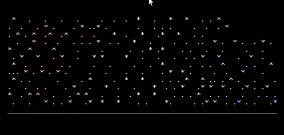

# Hidden #1

As usual the first thing to try while searching for hidden flags was a port scan.

```
$ nmap -sS challenges.hackvent.hacking-lab.com
Starting Nmap 7.70 ( https://nmap.org ) at 2018-12-04 16:08 CET
Nmap scan report for challenges.hackvent.hacking-lab.com (80.74.140.188)
Host is up (0.015s latency).
rDNS record for 80.74.140.188: urb80-74-140-188.ch-meta.net
Not shown: 992 filtered ports
PORT     STATE  SERVICE
21/tcp   open   ftp
22/tcp   open   ssh
23/tcp   open   telnet
80/tcp   open   http
443/tcp  open   https
```

FTP and telnet immediately caught my attention.

Telnet replayed an ASCII-art animation which started with snowing effect followed by Santa saying *THIS YEAR I DO NOT HAVE A FLAG FOR YOU, SORRY!* 



I dumped the animation to a text file to take a closer look.

```
$ telnet challenges.hackvent.hacking-lab.com > telnet.log
```

Then I opened [telnet.log](files/telnet.log) and spotted that there was some text hidden in the snowing animation. To extract it I came up with this ugly script.

```bash
$ tail -n +4 telnet.log | \
    sed 's/\x1b\[.*H//g' | \
    sed 's/[ _.*]//g' | \
    grep -v '^$' | \
    head -n 16 | \
    tr -d [:space:]
ctrl154n1llu51on
```
I realized that the format reminds me a password. FTP password maybe? But what is the login then?

FTP server identified itself as *Santas FTP-Server* so I guessed the login could be `santa`. It worked and I successfully logged in.

```
lftp ftp://santa@challenges.hackvent.hacking-lab.com:21
Password: 
lftp santa@challenges.hackvent.hacking-lab.com:~> set ftp:ssl-allow no  
lftp santa@challenges.hackvent.hacking-lab.com:~> ls
ls: Access failed: 550 Not enough privileges.
```

Since directory listing was disabled on the server I guessed the file name could be `flag.txt` and tried to download it directly.

```
lftp santa@challenges.hackvent.hacking-lab.com:~> get flag.txt
456 bytes transferred in 31 seconds (15 B/s)
``` 

It worked and I got [flag.txt](files/flag.txt) with following content.

```
__________________________________________________
 ___   _   _  _ _____ _   ___   ___ _      _   ___ 
/ __| /_\ | \| |_   _/_\ / __| | __| |    /_\ / __|
\__ \/ _ \| .` | | |/ _ \\__ \ | _|| |__ / _ \ (_ |
|___/_/ \_\_|\_| |_/_/ \_\___/ |_| |____/_/ \_\___|
                                                   
Congratulations! Well done! Here you go:
⚑ HV18-PORT-scan-sARE-essn-tial ⚑
Cheers @avarx_
__________________________________________________
```
