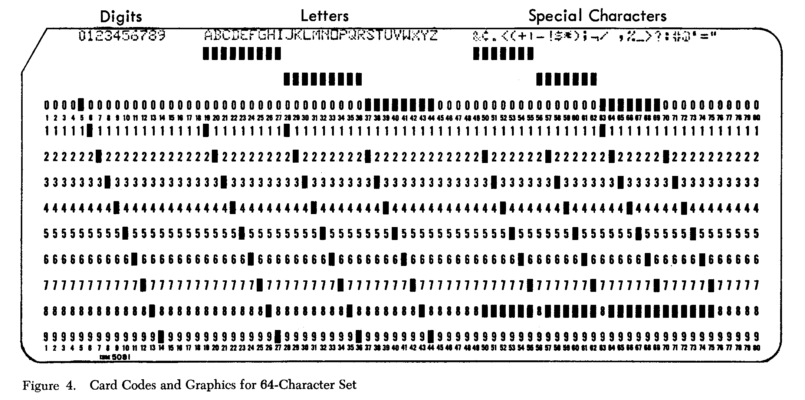

# Day -04: Old_School.jpg

I used binwalk on the [PDF](../day-10/files/ZOoxjUSe1OVB7OPoVrsX.pdf) file and found this interesting RAR archive in it.

```
$ binwalk -y rar -e ZOoxjUSe1OVB7OPoVrsX.pdf 
DECIMAL       HEXADECIMAL     DESCRIPTION
--------------------------------------------------------------------------------
236069        0x39A25         RAR archive data, version 4.x, first volume type: MAIN_HEAD

$ unrar l _ZOoxjUSe1OVB7OPoVrsX.pdf.extracted/39A25.rar 
UNRAR 5.61 beta 1 freeware      Copyright (c) 1993-2018 Alexander Roshal

Archive: _ZOoxjUSe1OVB7OPoVrsX.pdf.extracted/39A25.rar
Details: RAR 4

 Attributes      Size     Date    Time   Name
----------- ---------  ---------- -----  ----
    ..A....    369852  2018-12-01 21:44  Final_easy.zip
    ..A....    526371  2018-12-03 02:07  old_school.jpg
    ..A....      1438  2018-11-28 08:45  QR3C.png
    ..A....       564  2018-12-03 01:58  Santa.txt
    ..A....       739  2018-12-02 23:31  teaser.pls
----------- ---------  ---------- -----  ----
               898964                    5
```

I extracted a file named [old_school.jpg](files/old_school.jpg) from the archive.

```
$ unrar e _ZOoxjUSe1OVB7OPoVrsX.pdf.extracted/39A25.rar old_school.jpg
UNRAR 5.61 beta 1 freeware      Copyright (c) 1993-2018 Alexander Roshal

Extracting from _ZOoxjUSe1OVB7OPoVrsX.pdf.extracted/39A25.rar

Extracting  old_school.jpg                                            OK 
All OK
```


It was a [IBM 029](http://www.columbia.edu/cu/computinghistory/029.html) punch card which  was easy to decode by hand using the following charset table.



Flag: `HV18-0LD$-SCH0-0L1S-4W3S-0M3!`
