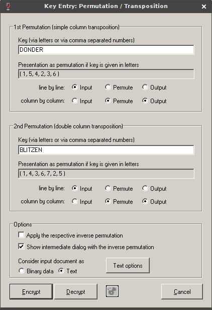

# Day -06: Santa.txt

I used binwalk on the [PDF](../day-10/files/ZOoxjUSe1OVB7OPoVrsX.pdf) file and found this interesting RAR archive in it.

```
$ binwalk -y rar -e ZOoxjUSe1OVB7OPoVrsX.pdf 
DECIMAL       HEXADECIMAL     DESCRIPTION
--------------------------------------------------------------------------------
236069        0x39A25         RAR archive data, version 4.x, first volume type: MAIN_HEAD

$ unrar l _ZOoxjUSe1OVB7OPoVrsX.pdf.extracted/39A25.rar 
UNRAR 5.61 beta 1 freeware      Copyright (c) 1993-2018 Alexander Roshal

Archive: _ZOoxjUSe1OVB7OPoVrsX.pdf.extracted/39A25.rar
Details: RAR 4

 Attributes      Size     Date    Time   Name
----------- ---------  ---------- -----  ----
    ..A....    369852  2018-12-01 21:44  Final_easy.zip
    ..A....    526371  2018-12-03 02:07  old_school.jpg
    ..A....      1438  2018-11-28 08:45  QR3C.png
    ..A....       564  2018-12-03 01:58  Santa.txt
    ..A....       739  2018-12-02 23:31  teaser.pls
----------- ---------  ---------- -----  ----
               898964                    5
```

I extracted a file named Santa.txt from the archive.

```
$ unrar e _ZOoxjUSe1OVB7OPoVrsX.pdf.extracted/39A25.rar Santa.txt
UNRAR 5.61 beta 1 freeware      Copyright (c) 1993-2018 Alexander Roshal

Extracting from _ZOoxjUSe1OVB7OPoVrsX.pdf.extracted/39A25.rar

Extracting  Santa.txt                                                 OK 
All OK
```

This was the content of the text file.

> Santa has caught up with the information age and does not trust
> clear-text commands anymore.  
> He has decided that all communications
> have to be encrypted to prevent an unfriendly take-over of his team.
> Santa chooses a simple, secure, and toolless encryption scheme.
> However, his team's memory capacity is limited and so he can only use
> their names (Dasher, Dancer, Prancer, Vixen, Comet, Cupid, Donder and
> Blitzen) as keys.
>  
> Where is the team headed to?
> 
> STTYN YATLOEP DNEA ONBL TGNTO MHEHH EISTIARIB FHSRA LD IIONA NL HERUV LN17-PTAA-RTON-RDOE-MCTN-AHCO

I had no idea what cipher was used so I decided to calculate the [Index of Coincidence](https://www.dcode.fr/index-coincidence) of the ciphertext. Since the IoC value was high it was sign that the message was probably encrypted using a transposition cipher or a monoalphabetic substitution.

After countless trials and errors with monoalphabetic substitutions I opened the ciphertext in [cryptool](https://www.cryptool.org/en/) and tried to decrypt it using the double transposition cipher with given keys.


 
This combination finally worked and decrypted the cipher text to this message.
 
> SANTA CALLING TEAM FULL SPEED AHEAD DIRECTION NORTH BY NORTH BY NORTH HV17-NORT-HPOL-EMAI-NSTA-TION

Flag: `HV17-NORT-HPOL-EMAI-NSTA-TION`
