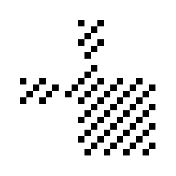
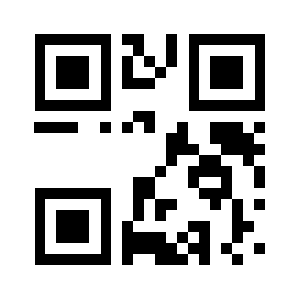
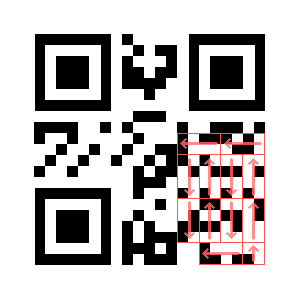
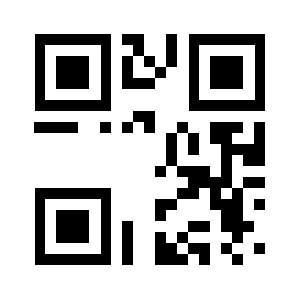
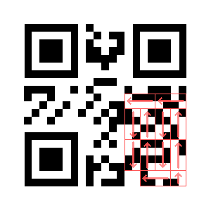
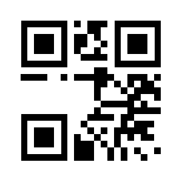
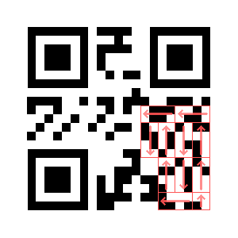

# Day -08: QR3C.png

I used binwalk on the [PDF](../day-10/files/ZOoxjUSe1OVB7OPoVrsX.pdf) file and found this interesting RAR archive in it.

```
$ binwalk -y rar -e ZOoxjUSe1OVB7OPoVrsX.pdf 
DECIMAL       HEXADECIMAL     DESCRIPTION
--------------------------------------------------------------------------------
236069        0x39A25         RAR archive data, version 4.x, first volume type: MAIN_HEAD

$ unrar l _ZOoxjUSe1OVB7OPoVrsX.pdf.extracted/39A25.rar 
UNRAR 5.61 beta 1 freeware      Copyright (c) 1993-2018 Alexander Roshal

Archive: _ZOoxjUSe1OVB7OPoVrsX.pdf.extracted/39A25.rar
Details: RAR 4

 Attributes      Size     Date    Time   Name
----------- ---------  ---------- -----  ----
    ..A....    369852  2018-12-01 21:44  Final_easy.zip
    ..A....    526371  2018-12-03 02:07  old_school.jpg
    ..A....      1438  2018-11-28 08:45  QR3C.png
    ..A....       564  2018-12-03 01:58  Santa.txt
    ..A....       739  2018-12-02 23:31  teaser.pls
----------- ---------  ---------- -----  ----
               898964                    5
```

I extracted a file named QR3C.png from the archive.

```
$ unrar e _ZOoxjUSe1OVB7OPoVrsX.pdf.extracted/39A25.rar QR3C.png
UNRAR 5.61 beta 1 freeware      Copyright (c) 1993-2018 Alexander Roshal

Extracting from _ZOoxjUSe1OVB7OPoVrsX.pdf.extracted/39A25.rar

Extracting  QR3C.png                                                  OK 
All OK
```

It looked like a colorful and somehow corrupted QR code.    


I opened it in Gimp and extracted all three RGB components which gave me three incomplete QR codes.

Then I had to learn how [QR code encoding](https://en.wikipedia.org/wiki/QR_code#Encoding) works in order to decode those codes by hand.

The first step was to decode the EC level and mask pattern:

*EC level*: L  
*Mask pattern*: (i + j) % 3 = 0

This is how the mask pattern looked like.



The next step was to XOR incomplete codes with the mask pattern (easily doable with layers in Gimp) and then read the code encoding, content length and finally the content itself using this scheme.


#### Red code

Original:



Unmasked:



Decoded:

*encoding*: byte encoding  
*content length*: 10

```
01001000  H
01010110  V
00110001  1
00111000  8
00101101  -
00110011  3
01001001  I
00110101  5
01100001  a
00101101  -
```

#### Green code

Original:



Unmasked:



Decoded:

*encoding*: byte encoding  
*content length*: 10

```
01010010  R
01101110  n
01110010  r
01101100  l
00101101  -
01110011  s
00110010  2
00111000  8
01110010  r
00101101  -
```

#### Blue code

Original:



Unmasked:



Decoded:

*encoding*: byte encoding  
*content length*: 9

```
01010011  S
01010010  R
01001000  H
01101010  j
00101101  -
01001100  L
01101000  h
01111010  z
01111000  x
```

Flag: `HV18-3I5a-Rnrl-s28r-SRHj-Lhzx`
