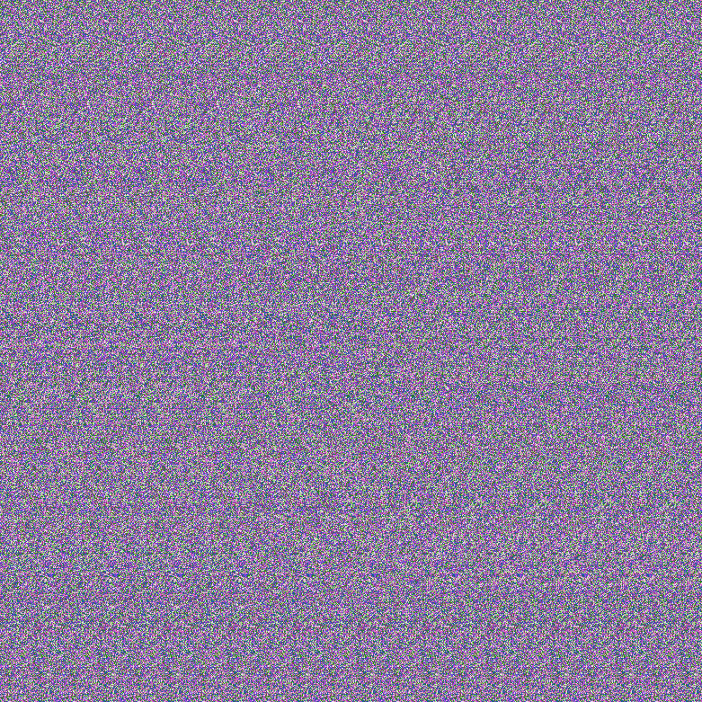
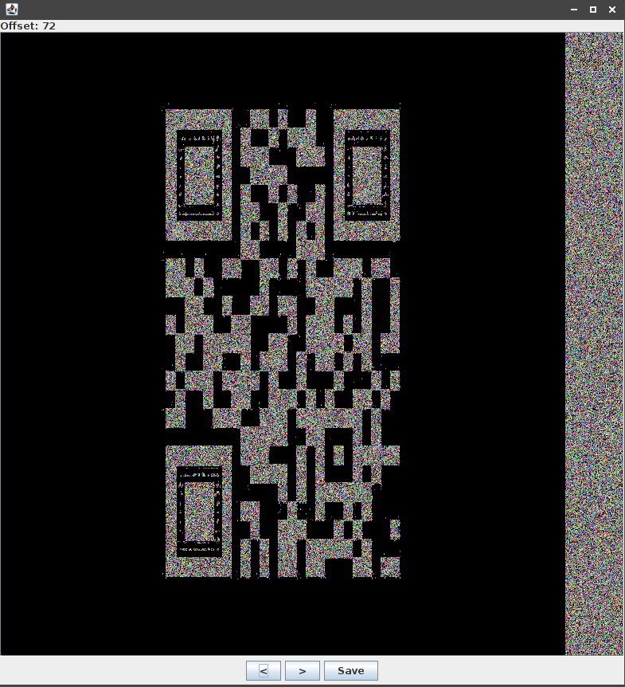
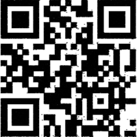

# Day -08: Stereogram

I extracted all the images from the [PDF](../day-10/files/ZOoxjUSe1OVB7OPoVrsX.pdf) and found one particularly interesting.

It immediately reminded me a [stereogram](https://en.wikipedia.org/wiki/Autostereogram) so I grabbed *stegsolve* and loaded the image into the stereogram solver.

Offset of 72 revealed this QR code.

I used my Gimp-fu to make it readable.

It decoded to: `HV18-p2LK-DNcI-YKw7-T9Ad-mH3v`
