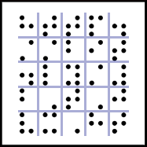
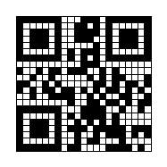

# Day -10: Dots

We are ready - r u?


Follow the white rabbit ...

### Solution

The image contained a Braille matrix.



It decoded to [http://bit.ly/2TJvxHt](http://bit.ly/2TJvxHt) which redirected me to [https://hackvent.hacking-lab.com/T34s3r_MMXVIII/Flag_Stage_1.png](https://hackvent.hacking-lab.com/T34s3r_MMXVIII/Flag_Stage_1.png).


This was a dotted variation of QR flag which looked like this.



It decoded to this text: *rushed by ...*

I must admit that it took me a while to figure out what does this mean. Then I finally realized that I perhaps rushed by and missed something.

I inspected the [bit.ly](http://bit.ly/2TJvxHt) redirect and found that I indeed missed one redirection.

```
$ curl -sIL http://bit.ly/2TJvxHt | grep '^\(Location\|HTTP\)'
HTTP/1.1 301 Moved Permanently
Location: https://hackvent.hacking-lab.com/T34s3r_MMXVIII/index.php?flag=UI18-GAUa-lXhq-htyV-w2Wr-0yiV
HTTP/1.1 302 Found
Location: https://hackvent.hacking-lab.com/T34s3r_MMXVIII/Flag_Stage_1.png
HTTP/1.1 200 OK
```

I found something which looked like a flag but not exactly. Luckily there was an easy fix for that: [ROT13 cipher](https://en.wikipedia.org/wiki/ROT13).

```
$ echo "UI18-GAUa-lXhq-htyV-w2Wr-0yiV" | rot13
HV18-TNHn-yKud-uglI-j2Je-0lvI
```

After submitting the flag, I learned that the are 9 more teaser challenges out there.

To be able to proceed to the next challenge I had to change the value of the URL parameter `flag` to the ROT13-decoded flag and download the content.

```
$ curl -sIL https://hackvent.hacking-lab.com/T34s3r_MMXVIII/index.php?flag=HV18-TNHn-yKud-uglI-j2Je-0lvI | grep '^\(Location\|HTTP\)'
HTTP/1.1 302 Found
Location: https://hackvent.hacking-lab.com/T34s3r_MMXVIII/ZOoxjUSe1OVB7OPoVrsX.pdf
HTTP/1.1 200 OK
$ wget -q https://hackvent.hacking-lab.com/T34s3r_MMXVIII/ZOoxjUSe1OVB7OPoVrsX.pdf
```

I got a PDF file named [ZOoxjUSe1OVB7OPoVrsX.pdf](files/ZOoxjUSe1OVB7OPoVrsX.pdf) which was the entry point for the rest of teaser challenges.
