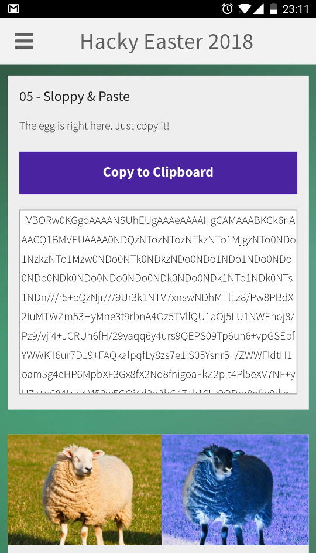
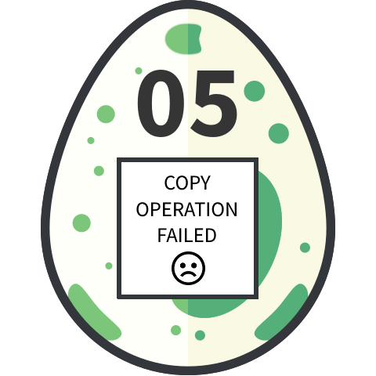

# 05 - Sloppy & Paste

This is a mobile challenge. Check it out in the Hacky Easter app!

### Screenshot



### Description

The instructions were simple but there was a catch. If you simply tried to copy/cut the Base64 string and decode it you got this egg:



### Solution

I quickly realized that the copied text was different from the content shown in the textarea. I decided to decompile the mobile app's apk and took a look at the [challenge page](files/challenge05.html).

There was a insidious script which handled attempts to copy/cut the text.

```javascript
function doClip() {
    window.location.href='ps://clip';
}
document.addEventListener('copy', function(e) {
    doClip();
    e.preventDefault();
});
document.addEventListener('cut', function(e) {
    doClip();
    e.preventDefault();
});
```

The `ps://clip` URL was handled by this method of `Activity` class.

```java
private void handleClip() {
        String text = getResources().getString(C0089R.string.egg_5);
        if (VERSION.SDK_INT < 11) {
            ((ClipboardManager) getBaseContext().getSystemService("clipboard")).setText(text);
        } else {
            ((android.content.ClipboardManager) getBaseContext().getSystemService("clipboard")).setPrimaryClip(ClipData.newPlainText("Copied Text", text));
        }
    }
```

This method put a different Base64 text defined as `egg_5` resource in `strings.xml` in to the clipboard.

The solution was really simple with decompiled application. All you had to do was to copy the textarea content directly from the challenge page [source](files/challenge05.html). 

### Egg

