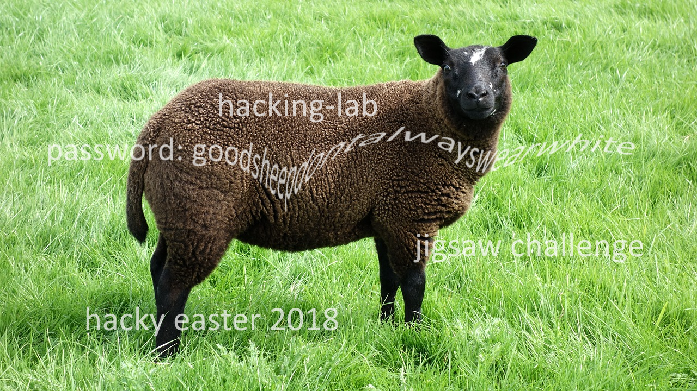

# 07 - Jigsaw

Thumper was probably under time pressure and jumped around a bit too wild. As a result, his picture has broken. Can you write a program to put it back together?

[jigsaw.png](files/jigsaw.png "jigsaw.png")

### Solution

This one was harder than I thought. I tried several jigsaw solvers I found, but the grass background caused them to fail terribly.

After some time I discovered this [solver](https://github.com/biswajitsc/jigsaw-solver) which achieved a partial success. Although I managed to get all the important parts of images together and after some painful manual work I got the password I was not satisfied. 

At the end I solved it without any additional manual work with this [solver](http://chenlab.ece.cornell.edu/people/Andy/research/puzzlePage.html) written in Matlab which worked like a charm!

I changed the input image location and dimensions and ran it in Octave.

```bash
$ octave-cli PuzzleDemoMGC.m
ans =

    720   1280

ans =

    720   1280      3

Compute Attributes for Puzzle
Done with Compute Attributes for Puzzle
Compute Pairwise Compatibility Scores for Puzzle, Method 7
Fit Number: 1
Fit Number: 2
Fit Number: 3
Fit Number: 4
Done with Score Computation for Puzzle Method 7
Processing Scores Matrix 1
Processing Scores Matrix 2
Processing Scores Matrix 3
Processing Scores Matrix 4
100     90 444  51 53 1 2 2 4 75 1112049 0.35
200     452 215 84 1 1 3 4 134 920186 0.42
300     414 511 1 1 1 2 179 752400 0.48
400     5 392   35 2 3 1 4 199 598257 0.53
500     258 568 181 17 1 3 139 142 209 448690 0.59
Start Trimming
```

This was the result:



The password was:

```
goodsheepdontalwayswearwhite
```

### Egg

