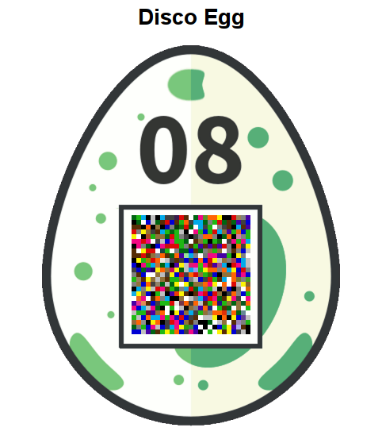

# 08 - Disco Egg

*Make things as simple as possible but no simpler.*  
-- Albert Einstein

[Click here](https://hackyeaster.hacking-lab.com/hackyeaster/disco/disco.html)

### Description

The page contained an egg with animated QR code whose pixels quickly changed colors in random order.



### Solution

The first thing was to take a look at the page [source code](files/disco.html). I found a javascript code responsible for the animation.

```javascript
bgcolors = [ "#1FB714", "#FBF305", "#006412", "#FF6403", "#DD0907", "#F20884", "#4700A5", "#0000D3", "#02ABEA", "#000000", "#ffffff", "#562C05", "#90713A", "#C0C0C0", "#808080", "#404040" ];
cellcolors = [];
cellcolors["black"] = "#000000";
cellcolors["white"] = "#ffffff";
cellcolors["green"] = "#1FB714";
cellcolors["yellow"] = "#FBF305";
cellcolors["darkgreen"] = "#006412";
cellcolors["orange"] = "#FF6403";
cellcolors["brown"] = "#562C05";
cellcolors["red"] = "#DD0907";
cellcolors["tan"] = "#90713A";
cellcolors["magenta"] = "#F20884";
cellcolors["lightgrey"] = "#C0C0C0";
cellcolors["purple"] = "#4700A5";
cellcolors["mediumgrey"] = "#808080";
cellcolors["blue"] = "#0000D3";
cellcolors["darkgrey"] = "#404040";
cellcolors["cyan"] = "#02ABEA";
$(document).ready(function() {
	var bgcolor = Math.floor(Math.random() * bgcolors.length);
	changeBg();
	$("td").each(function() {
		changeCell(this);
	});
});
function changeCell(thisObj) {
	var delay = Math.random() * 3000;
	var classList = $(thisObj).attr("class");
	var classes = classList.split(" ");
	var ccolor = Math.floor(Math.random() * bgcolors.length);
	var color = cellcolors[classes[ccolor]];
	$(thisObj).delay(delay).animate({ backgroundColor : color }, 500, "linear", function() {
		changeCell(thisObj);
	});
}
function changeBg() {
	var bgcolor = Math.floor(Math.random() * bgcolors.length);
	var c = bgcolors[bgcolor];
	var delay = Math.random() * 500;
	if (c == "#000000" || c == "#404040" || c == "#562C05" || c == "#4700A5" || c == "#0000D3" || c == "#006412") {
		$("h1").delay(delay).animate({ color : "#ffffff" }, 200);
	} else {
		$("h1").delay(delay).animate({ color : "#000000" }, 200);
	}
	$("body").delay(delay).animate({ backgroundColor : bgcolors[bgcolor], color : "#fff" }, 200, "linear", function() {
		changeBg();
	});
}
```

The interesting part was found in `changeCell` function. It was randomly choosing color of a cell based on its CSS classes. Cells had multiple color classes, but each cell had exactly one of white or black class. The mapping to QR code was therefore deterministic.

The only thing I had to do was to write a simple console script which reduced CSS classes of each cell to only black or white and let it settle for a while. After few seconds of animation the QR code was revealed.

### Egg

