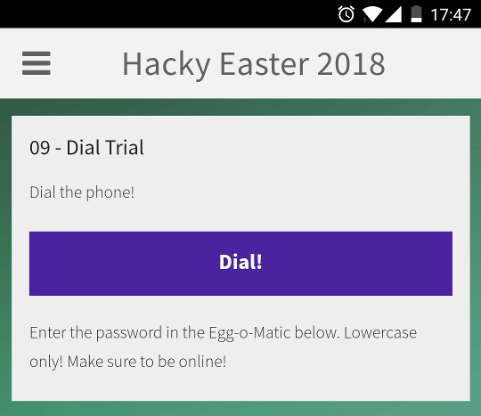
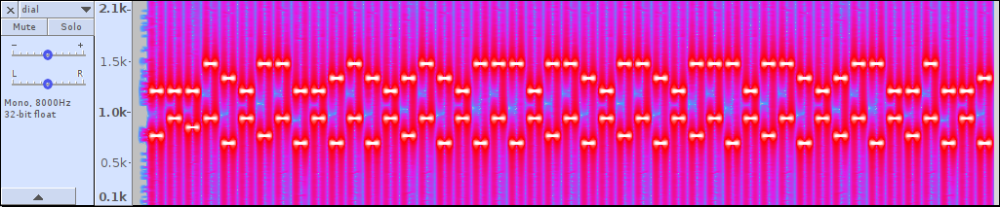

# 09 - Dial Trial

This is a mobile challenge. Check it out in the Hacky Easter app!

### Screenshot



### Description

The dial button started to play a dial tones sequence once clicked.

### Solution

The [dial sequence](files/dial.mp3) was stored in mp3 format inside the application apk so you could simple unzip the apk archive to grab it.

It used the [Dual-Tone Multi-Frequency Signaling](https://en.wikipedia.org/wiki/Dual-tone_multi-frequency_signaling) (DTMF) as shown on the following spectrogram from Audacity.



I found an [online tool](http://dialabc.com/sound/detect/index.html) which did the decoding part for me. It didn't accept mp3 format so I had to convert it to wav first.

```bash
$ ffmpeg -i dial.mp3 dial.wav
```

Then I uploaded the wav and let the tool decode it. This was the result:

```
4*7#2*6#1*2#2*5#2*3#3*6#2*6#2*6#3*6#2*5#3*4#1*2
```

It was the Multi-Tap Cipher used in the [first challenge](../egg01/README.md) again but this time a slightly different notation was used: `n*m` which meant `n` repetitions of digit `d`. `#` sign was used as a delimiter. This was the expanded version of the dial sequence.

```
7777 66 2 55 33 666 66 66 666 55 444 2
```

I once again used this [online tool](https://www.dcode.fr/multitap-abc-cipher) to decode the message and got this password:

```
snakeonnokia
```

### Egg

