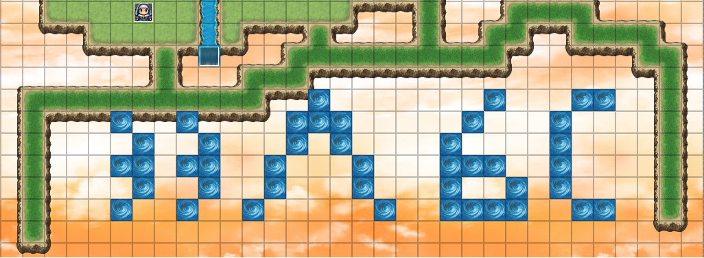

# 10 - Level Two

So you managed to beat the boss in the teaser game? This one won't be that easy!

You'll need [RPG Maker Run Time Packages](http://cached-downloads.degica.com/degica-downloads/RPGVXAce_RTP.zip) to run the game.

Hints: There are several parts to be found. Combine them, and enter the final flag in the egg-o-matic below, without spaces! Saving the game from time to time certainly helps.

[game.zip](files/game.zip)

### Solution

Since I have already learned a lesson from the teaser I completely skipped any attempt to actually play the game. Instead I decided to use the game editor to solve this challenge.

The first step was to extract/install the game using wine.

```bash
$ unzip game.zip 
Archive:  game.zip
  inflating: HackyEaster RPG.exe 
$ WINEPREFIX="$(pwd)/wine" wine "HackyEaster RPG.exe"
```

Then I was looking for the encrypted game file.

```bash
$ find "HackyEaster RPG" -type f
HackyEaster RPG/Game.ini
HackyEaster RPG/System/RGSS301.id0
HackyEaster RPG/System/RGSS301.nam
HackyEaster RPG/System/RGSS301.dll
HackyEaster RPG/System/RGSS301.til
HackyEaster RPG/System/RGSS301.id1
HackyEaster RPG/Game.exe
HackyEaster RPG/Game.rgss3a
```

Decryption of the `Game.rgss3a` was done by [this decryptor](https://wiki.rpgmaker.es/ayuda/utilidades/rpg-maker-xp-vx-vx-ace-decrypter).

```bash
$ wget -q https://wiki.rpgmaker.es/_media/ayuda/utilidades/rgssad.rgss2a.rgss3a.decrypter.zip
$ unzip rgssad.rgss2a.rgss3a.decrypter.zip
Archive:  rgssad.rgss2a.rgss3a.decrypter.zip
  inflating: RGSSAD - RGSS2A - RGSS3A Decrypter.exe  
$ WINEPREFIX="$(pwd)/wine" wine "RGSSAD - RGSS2A - RGSS3A Decrypter.exe"
```

Then I simply replaced the `Game.rgss3a` file in the installation directory by the extracted files and made my [decrypted version](files/game-decrypted.zip) of the game.

The next step was to download [trial version](http://www.rpgmakerweb.com/download/free-trials/trial-rpg-maker-vx-ace) of the RPG Maker VX Ace and load the decrypted version of the game into it.

I looked at the items list and quickly found an egg. It had this description.

```
7034353577307264355f3472335f6330306c
```

The hint stated that there are several parts to be found so I continued in searching the other ones. I inspected all the map events and found the three other hexed parts:

```
7034353577307264355f052d066b15035433
70343535773072105d6c6b05032d0f546f4c
7034353577307264355f3406033b5749114c
```

It was a time to figure out how to combine them together. Luckily I found the last missing piece - a hint drawn by a different type of texture on the map of the last part of the game called heaven.



At first I accidentally misidentified the middle character as `A` instead of the correct `^` which cost me some time. Later I realized that it suggests to use `XOR`.

I wrote [this](../../src/main/scala/hackyeaster2018/Egg10.scala) simple Scala program to xor the hexed values for me and convert them to ASCII strings.

```
          1_54v3d_
       th3_w0rld_
           t0d4y!
```

The password was:

```
1_54v3d_th3_w0rld_t0d4y!
```

### Egg

