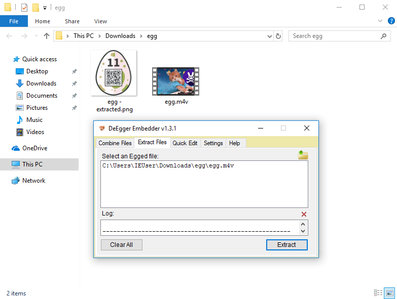

# 11 - De Egg you must

Who was first, the cat or the egg?

[basket.zip](files/basket.zip)

### Solution

The zip archive was protected by a password so the first step was to crack it using a suitable [dictionary](files/dictionary/top_10000.txt).

```bash
$ fcrackzip -D -u -p ./dictionary/top_10000.txt basket.zip
PASSWORD FOUND!!!!: pw == thumper

$ unzip basket.zip
Archive:  basket.zip
[basket.zip] egg1 password: thumper
  inflating: egg1
  inflating: egg2
  inflating: egg3
  inflating: egg4
  inflating: egg5
  inflating: egg6
```

Then I looked at what I got.

```bash
$ file egg?
egg1: ISO Media, Apple iTunes Video (.M4V) Video
egg2: data
egg3: data
egg4: data
egg5: data
egg6: data
```

The media file looked corrupted or incomplete. The challenge description was talking about a cat and an egg so I immediately tried to concatenate those egg files using `cat` command.

```bash
$ cat egg1 egg2 egg3 egg4 egg5 egg6 > egg.m4v
```

It worked and I got a playable [movie file](files/egg.m4v).

At this point I got completely lost. I manually inspected the movie frame by frame and discovered some suspicious black horizontal bars at the end of the movie which looked promissing at first look. I fell into a rabbit hole.

It took me several days to realize I have to scrap this idea and make a step back. I started to look for a video steganography tools which might do the job. After countless attempts, I added `deegg` keyword from the challenge title to my google search query. Heureka! I finally found the tool I needed - [DeEgger Embedder](http://www.zasi.org/DeEgger-Embedder.php).

I used this tool to extract the egg hidden in the movie.



I must admit that this challenge was a disappointment to me. It had much higher potential.

### Egg

