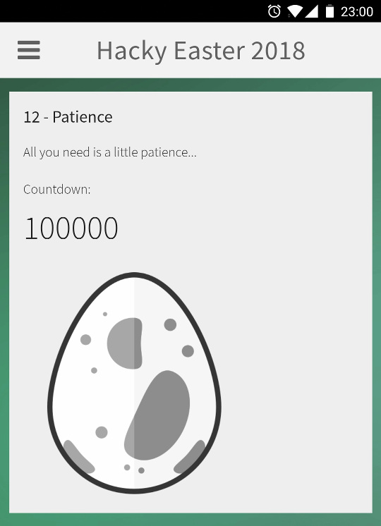

# 12 - Patience

This is a mobile challenge. Check it out in the Hacky Easter app!

### Screenshot



### Description

There was a counter which started at value of 100000 and very slowly decremented itself. It would really need a lot of patience to wait for it to count down to zero.

### Solution

I extracted that page from the application's apk and looked at its [source](files/challenge12.html).

There I found the javascript implementation of the counter.

```javascript
hash = 'genesis';
count = 100000;
setTimeout( function() { document.location.href = 'ps://count?h=' + hash + '&c=' + count; } , 1000);
function countFeedback(jsonString) {
    var json = JSON.parse(jsonString);
    if (json) {
        hash = json.h;
        count = json.c;
        $('#count').text(count);
        if (count == 0) {
            document.getElementById('flag').setAttribute('src', 'https://hackyeaster.hacking-lab.com/hackyeaster/images/eggs/'+hash+'.png');
        } else if (count > 0) {
            setTimeout( function() { document.location.href = 'ps://count?h=' + hash + '&c=' + count; } , 3000);
        }
    }
}
```

The `ps://count` URL was handled by this code of `Activity` class.

```java
if (url.startsWith(Activity.URL_COUNT)) {
    uri = Uri.parse(url);
    final String h = uri.getQueryParameter("h");
    final String c = uri.getQueryParameter("c");
    final WebView fView = view;
    new Handler().postDelayed(new Runnable() {
        public void run() {
            String json = Activity.this.handleCount(h, c);
            if (json != null) {
                fView.loadUrl("javascript:countFeedback('" + json + "');");
            }
        }
    }, 7000);
    return true;
}
```

```java
private String handleCount(String h, String c) {
    if (!(c == null || h == null)) {
        try {
            Integer count = Integer.valueOf(Integer.parseInt(c));
            String hash = sha1(h + c);
            if (count.intValue() >= 0) {
                return "{ \"h\":\"" + hash + "\", \"c\":\"" + (count.intValue() - 1) + "\" }";
            }
        } catch (Exception e) {
        }
    }
    return null;
}
```

I decided to rewrite the timer into a Scala [program](../../src/main/scala/hackyeaster2018/Egg12.scala) to remove those timeouts from it.

```scala
var hash = "genesis"
var count = 100000

while (count > 0) {
    hash = sha1hex(hash + String.valueOf(count))
    count -= 1
}

println(s"https://hackyeaster.hacking-lab.com/hackyeaster/images/eggs/$hash.png")
```

The result URL of the flag was:

```
https://hackyeaster.hacking-lab.com/hackyeaster/images/eggs/dd6f1596ab39b463ebecc2158e3a0a2ceed76ec8.png
```

### Egg

