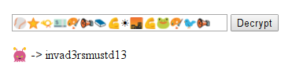

# 17 - Space Invaders

Alien space invaders left a secret message. Luckily, you know that they used codemoji.org for the encryption.

Decrypt the message, and save the planet!!

[invaders_msg.txt](files/invaders_msg.txt)

### Solution

This challenge was easily solvable if you have noticed that there was a *space invader* emoji on the [codemoji.org](https://codemoji.org) site which you could use to unscramble the message. Unfortunately this was not my case...

I didn't expect the key to unscramble the message to be so obvious. Since the total number of all possible keys was not that high I decided to download codemoji source code from [GitHub](https://github.com/mozilla/codemoji) and wrote a [cracker](files/cracker) on top of it to bruteforce the decryption.

It tries all the possible keys one by one and outputs only the keys which results in a message whose all characters are in ASCII range.



At this point I finally realized that there was a much more simple solution. I wish I was more attentive...

The message was:

```
invad3rsmustd13
```

### Egg

