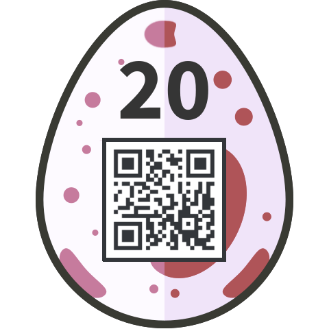

# 20 - Artist: No Name Yet

Great musical compositions are being published lately, by an unknown producer. Nobody was able yet to unveil the genius behind. It is said that he or she is placing secret messgages in his compositions.

You got hold of the original files of the latest masterpiece. Uncover the hidden message, and enter it into the Egg-o-Matic below, case and digits only.

[artist.zip](files/artist.zip)

### Solution

I extracted the files from the ZIP archive to look what I got.

```bash
$ unzip artist.zip 
Archive:  artist.zip
  inflating: nonameyet.mid           
  inflating: sheet.pdf
```

I started with the [PDF file](files/sheet.pdf). It contained a musical notes part which didn't make any sense. There was a hint `NO GLYPH` at the beggining and at the end of the part. I copied that part to my clipboard and pasted it to a text editor with an ordinary font. It gave me this message:

> Okay, let’s do the information exchange as we coordinated. First let me tell you: hiding informations in a MIDI file will be popular soon! We should only do it this way to stay covered. MIDI hiding is just next level – wow! So, here are all informations you need to find the secret: Trackline: Can’t remember now, but you’ll find it. It’s kinda quiet this time, because of the doubled protection algorithm! Characters: 0 - 127 (by the way: we won‘t need the higher ones ever…) Let’s go!

At this moment I moved to the [MIDI file](files/nonameyet.mid). I inspected all the tracklines manually but found nothing interesting. Then I decided to try to find some information about MIDI steganography on Google. I was lucky and found [this article](https://www.scribd.com/document/356557955/M-and-files-crypting) about LSB algorithm used in steganography.

It inspired me to write my own [decryption tool](../../src/main/scala/hackyeaster2018/Egg20.scala) in Scala which processed the velocity parameter of the `NOTE_ON` commands. I let it decrypt the provided MIDI file:

```
track  3: QQNNQRNSNSMEGMNNPNNKNQORPQOMKLJNLOMKIPNNLQONLNLOMKINLPNRPOPMSSRRPQQORPLOPQSQP\]`_RSRTSTRLQTTR
track  9: `d_WUU_SWSZZV^QWW`adN[Y]cZZ_Za`]^V[NZ
track 16: -.-. --- -- .--. --- ... . -.. -... -.-- -.. .--- ... .--. ----- ----- -. -.--
track 22: ((-2:><==>C@C;;;;;;>;<@><<><6<=:>@9;@<<Eaa__]]\\``\\aaXXbbZZ^^``__[[\\^^\\bb__VVXX``]]^^aaee^^aa\\ee__\\``^^ccaabbca`a^eeccabb`ca]`abebacdafe\bbffdaaee`_deb]" 0
track 31: QRRRPTQPOO65OOO;4ON?<N@;KN49NN@=NNN=9>NP9;<:P;wstwsnokpmopimgrqpijPVGVVOTWWWWWWY^\[W\Y[``^^]^\]^]^[^\X`][\]`]\st[p\]`]\uvu\S
track 34: u>YX;G>;682?3?0:342;6;6<8;68;:8><D8MSkV]98@7<=4E697@8=6;;<7A>D9E3=>?@A;A9N4VNobE3:356>6B39*G7>>D4>8G4@;24=DF<DBDDHDMNg_KVM8:<)3216?238:797AFC4C;C9<9I9D@M@PNS-OV_t_F<R;G9;7E2;;;BC@K<@8I>ODPDJKHIZKdekY-DF8F;>@8>HFNF[g`IB9F9G<GI/BK@HFP\]YJ@JDBBDIR@@<J4VS\NU<U>NI\eXBXDYYdYq}Zfttqx}~}
track 38: .8@<DBDB;$$74>S@DN;BF6F>9<>FBKDB33/7KQ\QNSF9@>>29<I89B;7DD8KSS>FQD;>DBNF9@Q_<;KB@beK4IYDVK\_V<V>N8F\BN<0gd[\^YZgZ_`\^_]]e][kc^`dd_jiphkphpnkpmiuyghitkppemtghompghntofjiiisgnplkihghghoihjhicjkimngeghhankmwx_Zv{~_mvsy]~_Pvbjpp]js_vev_i_b_Vyobybsovjy~RoeXgv{]gjeoP-gyvbgTmoomio~z\_{voo]~vo~epbmmMovbpmv{jevRpyjg{ms_AyvL,Gojypjvsvy~`SSCNgRu]rrHgrVjwrwoLQrfV[gYgSggagSmwUV^ZSL2Hw]o^YjaYaCyjraLQ[WVVjNdNgjVgD|ouZQ^Z[gcoRa[j[jcysorlormoqfvk{kpwpoofttsys{umskromnqlyp{qpsosppqqnwp{plrsossyqkilnikurtst|gioinoy
track 42: falfeecd``_`aaa`bad`fcecig^`ccab`bd`fh`a__`_a`cbij`cabdfdddehgdeeeefdefdfcdcbd`__`e``^eae``afebef`ebfiidgjbghgeh_eccgibegdeegcfbh^i_dfghbehadfkdgd`b``ac^c`dcd_d]e`eadbdci_ecccecdbdah`gbde_hceceeicdfcef^fgad_hd_fcaggk``dgccihdieeqcdcg^`Z\^`Z^]^a\``[cZTZX^\^Z^a`a\^a]cc`Z`Z^a^[`_e\d`\c^_d\c]Za`Z[bd`ccaZaccc_e^adeaeegfbi]^gfhdc^`debcc`ee]f`afc`eabecbfbfb`d`cchZ_fg\df_adaccac]gdg^^b]ca\ba`bcacc`cb`_abcdccdcdfgkgnlsgicfjbigdgkeimhkqijnhmkhkmgimsnmvqvrgkalieghcknehifglqkgkqmkjkpiknkgopwhlmpmqkqlstlhhi^ldfkebncdgf[
track 54: 2=759.J64Q(JKg3^SrY_;IF7!QVt1BDP;CID@M:<Oj'?NDI2MOR26KFVKZVbBF\9HIHUF+ADQZd*COZOVZZDQH@;=OQL=;FOQ9=EIETH;HIQZJc`___]b_^b]hgZrzmYbZ`ibd_j\rff]WQ^\fXS]Z`jjDdF`fk4`fakUf]WQ^\fXS]Z`^jS`QMSZ`IOdk^_kgQlqqoxygQlqqoxy
```

Track 16 looked like a morse code:

```
-.-. --- -- .--. --- ... . -.. -... -.-- -.. .--- ... .--. ----- ----- -. -.--
```

The last step was to demorse the secret of this trackline. The hidden message was:

```
COMPOSEDBYDJSP00NY
```

### Egg

