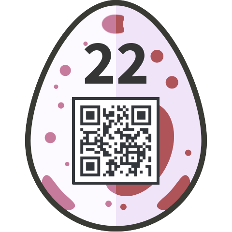

# 22 - Block Jane

You intercepted an encryped message by Jane. Can you decrypt it?

You know that AES was used, and that the following service is receiving such encrypted messages:

```
whale.hacking-lab.com 5555
```

Find the password and enter it in the Egg-o-Matic below!

[secret.enc](files/secret.enc)

### Solution

The description said it all. The message was encrypted with AES block cipher and there was a service consuming such messages. It was a clear clue to the [Padding Oracle Attack](https://en.wikipedia.org/wiki/Padding_oracle_attack).

The solution was pretty straightforward. After successful manual verification that the service is vulnerable I wrote a [generic implementation](../../src/main/scala/tools/PaddingOracle.scala) of this attack in Scala and then implemented the [oracle](../../src/main/scala/hackyeaster2018/Egg22.scala) for this challenge.

It ran for a while and then I got the decrypted version of the message:

```
assword is: oracl3in3delphi

See you soon!

Jane
```

### Egg

