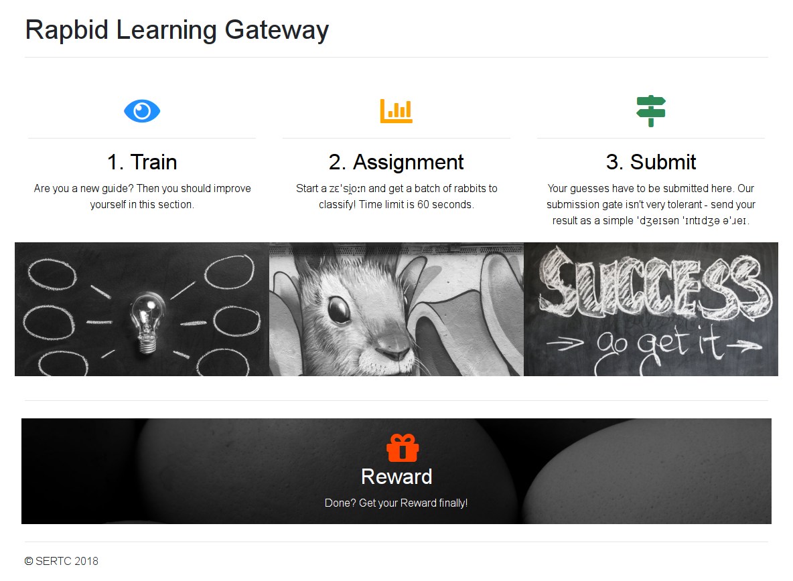

# 23 - Rapbid Learning

The SERTC (*super exciting rabbit travel company*) wants to use the latest technology.

They currently employ an experienced guide, which is classifying the visitors into *Goodtails* and *Luckyspoons*. For the trained eye of the guide, this is easy. But how do you get a machine to do it (which would be cheaper)?

Go and help them implement a learning algorithm! Their platform is available here:

```
http://whale.hacking-lab.com:2222 
```

Since quality is the main concern of SERTC, they expect an accuracy of at least 99%.

### Screenshot



### Description

This challenge consisted of three steps.

#### Train

> Are you a new guide? Then you should improve yourself in this section.

This [endpoint](http://whale.hacking-lab.com:2222/train) provided training data in JSON format. One per each GET request.

#### Assignment

> Start a zɛˈsi̯oːn and get a batch of rabbits to classify! Time limit is 60 seconds.

Once you trained your model you could use this [endpoint](http://whale.hacking-lab.com:2222/gate) to generate your assignment.

#### Submit

> Your guesses have to be submitted here. Our submission gate isn't very tolerant - send your result as a simple ˈdʒeɪsən ˈɪntɪdʒə əˈɹeɪ.

Submissions of your classification predictions were done by POST requests to this [endpoint](http://whale.hacking-lab.com:2222/predict).

### Solution

I translated all the words from the [phonetic transcriptions](https://en.wikipedia.org/wiki/International_Phonetic_Alphabet).

> zɛˈsi̯oːn = session  
> ˈdʒeɪsən = JSON  
> ˈɪntɪdʒə = integer  
> əˈɹeɪ = array  

Then it was clear what was needed to be done:
1. train the classification model
2. start a session and get an assignment
3. calculate predictions and submit them within 60 seconds as a JSON integer array

I wrote a Scala program to download training dataset.

```scala
private val http = HttpClients.createDefault()
private val trainUri = URI.create("http://whale.hacking-lab.com:2222/train")

def main(args: Array[String]): Unit = {
  println("downloading train data...")
  downloadTrainData(10000, "/tmp/train_data.txt")
}

private def downloadTrainData(size: Int, dest: String): Unit = {
  val writer = new PrintWriter(dest)
  try {
    val request = new HttpGet(trainUri)
    for (i <- 0 until size) {
      val data = http.execute(request, new BasicResponseHandler())
      writer.println(data)
    }
  } finally {
    writer.close()
  }
}
```

Then I almost started to build a machine learning devstack for this classification problem, but I changed my mind at the last minute. This is a HackyEaster challenge so there had to be a simpler way how to solve it...

I decided to take a look at the [train dataset](files/train_data.txt) and try to find some correlations among the data attributes by hand. I chose to do it from commandline.

```bash
$ cat /tmp/train_data.txt | sed 's/[{}]//g' | cut -d, -f1,8 | sort -u
"sp00n": 10, "g00d": false
"sp00n": 10, "g00d": true
"sp00n": 11, "g00d": false
"sp00n": 11, "g00d": true
"sp00n": 12, "g00d": false
"sp00n": 13, "g00d": false
"sp00n": 14, "g00d": false
"sp00n": 7, "g00d": true
"sp00n": 8, "g00d": true
"sp00n": 9, "g00d": true
```

Found correlation: `false` for `sp00n >= 12`, `true` for `sp00n <= 9`

```bash
$ cat /tmp/train_data.txt | sed 's/[{}]//g' | cut -d, -f3,8 | sort -u
 "t41l": 10, "g00d": false
 "t41l": 10, "g00d": true
 "t41l": 11, "g00d": false
 "t41l": 11, "g00d": true
 "t41l": 8, "g00d": true
 "t41l": 9, "g00d": true
```

Found correlation: `true` for `t41l <= 9`

```bash
$ cat /tmp/train_data.txt | sed 's/[{}]//g' | cut -d, -f4,8 | sort -u
 "w31ght": 2, "g00d": false
 "w31ght": 3, "g00d": true
 "w31ght": 4, "g00d": true
 "w31ght": 5, "g00d": true
```

Found correlation: `false` for `w31ght == 2`, `true` for `w31ght >= 3`

```bash
$ cat /tmp/train_data.txt | sed 's/[{}]//g' | cut -d, -f5,8 | sort -u
 "c0l0r": "black", "g00d": false
 "c0l0r": "blue", "g00d": true
 "c0l0r": "brown", "g00d": false
 "c0l0r": "brown", "g00d": true
 "c0l0r": "green", "g00d": true
 "c0l0r": "grey", "g00d": true
 "c0l0r": "purple", "g00d": true
 "c0l0r": "red", "g00d": false
 "c0l0r": "red", "g00d": true
 "c0l0r": "white", "g00d": true
```

Found correlation: `false` for `c0l0r == "black"`, `true` for `c0l0r in ["blue", "green", "grey", "purple", "white"]`

The other data attributes have no correlations with the classification attribute.

I extended my program with methods for handling the assignment and starting a session. It was also necessary to tweak the underlying http client a bit in order to handle `session_id` cookie correctly.

```scala
case class Assignment(attributes: Array[String], data: Array[Array[JsValue]])

private val http = HttpClients.custom()
  .setDefaultRequestConfig(RequestConfig.custom().setCookieSpec(CookieSpecs.STANDARD).build())
  .build()

private val assignmentUri = URI.create("http://whale.hacking-lab.com:2222/gate")

def main(args: Array[String]): Unit = {
  println("downloading assignment data...")
  val sessionid = downloadAssignment("/tmp/assignment.txt")
  val assignment = loadAssignment("/tmp/assignment.txt")
}

private def downloadAssignment(dest: String): String = {
  val writer = new PrintWriter(dest)
  try {
    val request = new HttpGet(assignmentUri)
    val context = HttpClientContext.create()
    val assignment = http.execute(request, new BasicResponseHandler(), context)
    writer.println(assignment)
    context.getCookieStore.getCookies.asScala.find(_.getName == "session_id").map(_.getValue).get
  } finally {
    writer.close()
  }
}

private def loadAssignment(path: String): Assignment =
  Source.fromFile(path).mkString.parseJson.convertTo[Assignment]
```

Then it was time to add my rule-based predictor based on the discovered correlations and a method to submit my predictions.

```scala
private val predictionUri = URI.create("http://whale.hacking-lab.com:2222/predict")

def main(args: Array[String]): Unit = {
  val assignment = loadAssignment("/tmp/assignment.txt")

  println("calculating predictions...")
  val prediction = predictAssignment(assignment)

  println("submitting predictions...")
  val result = submitPrediction(prediction, sessionid)
  if (!result.contains("reward for this shift at /reward")) {
    throw new RuntimeException(result)
  }
}

private def predictAssignment(assignment: Assignment): Array[Int] = {
  val order = assignment.attributes.map(b => ascii(b64Decode(b))).zipWithIndex.toMap
  assignment.data.map { d =>
    val sp00n = d(order("sp00n")).convertTo[Int]
    val t41l = d(order("t41l")).convertTo[Int]
    val w31ght = d(order("w31ght")).convertTo[Int]
    val c0l0r = d(order("c0l0r")).convertTo[String]

    val predictions = List(predictBySp00n(sp00n), predictByT41l(t41l), predictByW31ght(w31ght), predictByC0l0r(c0l0r)).flatten
    if (predictions.head) 1 else 0
  }
}

private def predictBySp00n(sp00n: Int): Option[Boolean] =
  sp00n match {
    case i if i >= 12 => Some(false)
    case i if i <= 9 => Some(true)
    case _ => None
  }

private def predictByT41l(t41l: Int): Option[Boolean] =
  t41l match {
    case i if i <= 9 => Some(true)
    case _ => None
  }

private def predictByW31ght(w31ght: Int): Option[Boolean] =
  w31ght match {
    case i if i >= 3 => Some(true)
    case 2 => Some(false)
    case _ => None
  }

private def predictByC0l0r(c0l0r: String): Option[Boolean] =
  c0l0r match {
    case "blue" | "green" | "grey" | "purple" | "white" => Some(true)
    case "black" => Some(false)
    case _ => None
  }

private def submitPrediction(prediction: Array[Int], sessionid: String): String = {
  val request = new HttpPost(predictionUri)
  request.setEntity(new StringEntity(prediction.mkString("[", ",", "]"), ContentType.APPLICATION_JSON))
  val context = HttpClientContext.create()
  context.setCookieStore(new BasicCookieStore())
  context.getCookieStore.addCookie(sessionCookie(sessionid))
  http.execute(request, new BasicResponseHandler(), context)
}
```

And it worked! After running it i got this result:

```
SCORE: MTAwLjAl - lolnice! - I'll tell my guys to set up your reward for this shift at /reward, don't forget to bring your cookie!
```

My score was perfect.

```bash
$ echo "MTAwLjAl" | base64 -d
100.0%
```

The last missing piece was a method to pick up my reward and save it to a file.

```scala
private val rewardUri = URI.create("http://whale.hacking-lab.com:2222/reward")

def main(args: Array[String]): Unit = {
  println("getting reward...")
  val reward = getReward(sessionid)

  println("saving reward...")
  saveReward(reward, "hackyeaster2018/challenges/egg23/files/egg.png")
}

private def getReward(sessionid: String): String = {
  val request = new HttpGet(rewardUri)
  val context = HttpClientContext.create()
  context.setCookieStore(new BasicCookieStore())
  context.getCookieStore.addCookie(sessionCookie(sessionid))
  val response = http.execute(request, new BasicResponseHandler(), context)
  val reward = response.lines.find(_.contains("img")).get
  reward.substring(reward.indexOf('"') + 1, reward.lastIndexOf('"'))
}

private def saveReward(reward: String, path: String): Unit = {
  val encoded = reward.substring(reward.indexOf(',') + 1)
  val decoded = b64Decode(encoded)
  saveToFile(path, decoded)
}
```

Final version of my program to solve this challenge can be found [here](../../src/main/scala). As a reward I got the egg as a Base64-encoded image embedded in the reward page.

### Egg

