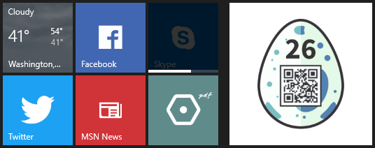

# 26 - Hidden Egg #2

This egg is hidden in a very sub*tile* manner. Perhaps you need to browse on the edge.

### Solution

This one was for sure the hardest of all hidden eggs for me. The first hint written in italics referred to a *tile*. The second one advised to *browse on the edge*.

It was clear that I have to use the Microsoft Edge web browser but since I'm not a Windows user and I never used Edge before it took me a while to put both hints together and figure out how to find the egg.

I had to open the challenge page in Edge browser and pin the page to the start panel as a tile. It did not display the egg so I tried to change its size to a larger one which did the trick.



Alternatively you could look at [browserconfig.xml](https://hackyeaster.hacking-lab.com/browserconfig.xml) and download the [large icon](https://hackyeaster.hacking-lab.com/hackyeaster/images/tiles/mstile-310x310.png) directly:

```bash
$ wget -Oegg.png -q https://hackyeaster.hacking-lab.com/hackyeaster/images/tiles/mstile-310x310.png
```

### Egg

