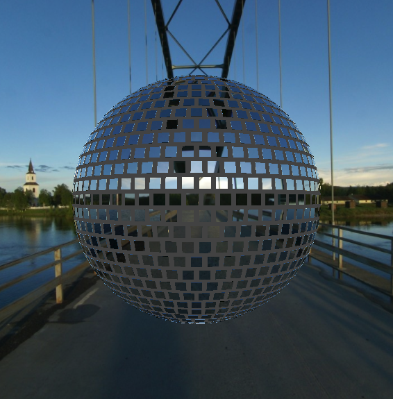
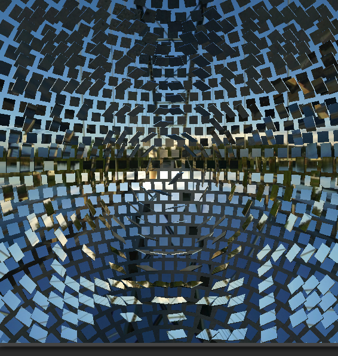
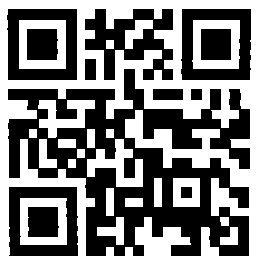

# 03 - Disco 2

This year, we dance outside, yeaahh! See [here](https://hackyeaster.hacking-lab.com/hackyeaster/challenges/disco2/disco2.html).

### Description

The link brought you to a page with a 3D scene containing a sphere made of little squared mirrors. 



### Solution

The scene was interactive so you could move the position of the camera and change its angle.

If you moved the camera inside the sphere you found out that there were another mirrors hidden inside.



If you took a closer look you could recognize that they form a QR code.

It was time to dive into the source code to extract it. I found a file called [mirrors.js](files/mirrors.js) which contained 3D coordinates of all the mirrors used in the scene. I filtered the mirrors to get only the [relevant ones](files/mirrors-qrcode.js).

Then I did following modifications to the HTML file:
  * Removed unnecessary objects and textures from the scene
  * Changed the material of mirrors from reflexive to non-reflexive white
  * Set the right angle of the mirrors by commenting out the line containing `mirrorTile.lookAt(center)` 

The result QR code had colors inverted so I inverted them back in Gimp.



### Flag

```
he19-r5pN-YIRp-2cyh-GWh8
```
