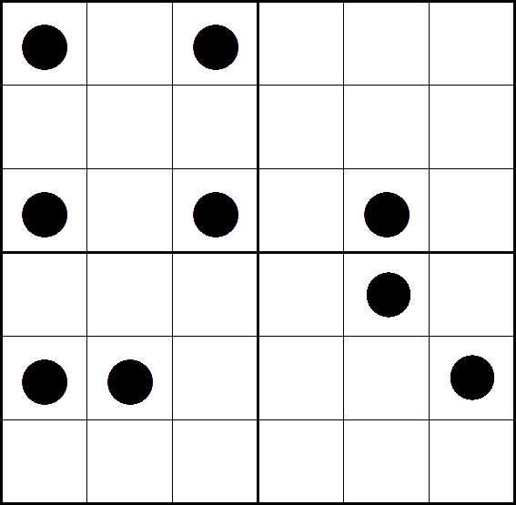
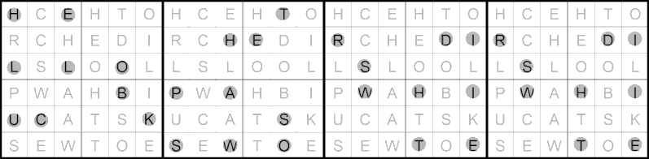
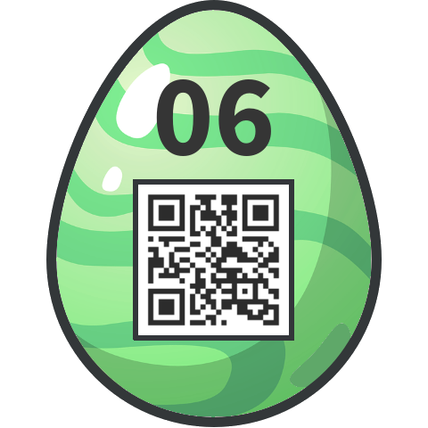

# 06 - Dots

Uncover the dots' secret!

Then enter the password in the *egg-o-matic* below. **Uppercase only**, and **no spaces**!


### Solution

Dots are the mask for reading letters from the corresponding grid positions, but it is not complete. So the first step was to complete the mask in the lower-right quadrant. After inspecting positions of dots I noticed that none of them share the same position inside the quadrant. Therefore I supposed that the missing dots have the same property and put dots on the positions which left unoccupied. That gave me this mask.



Then I applied all four possible rotation of the mask in anti-clockwise order and read letters row by row in each quadrant.



That gave me:

```
HELLO BUCK THE PASSWORD IS WHITE CHOCOLATE
```

### Egg


