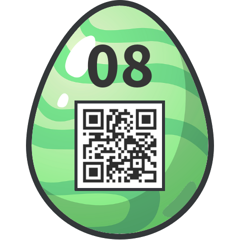

# 08 - Modern Art

Do you like modern art?


### Solution

This challenge was a trolling masterpiece. Small QR codes said "remove me". So I did. Then I spent literally hours trying to solve it graphically. I hoped that I could find another smaller QR code sharing the same pixels with the original one. Such a waste of time...

Then i tried different approach. I inspected the image file.  

```
$ strings -n 20 modernart.jpg 
(E7EF085CEBFCE8ED93410ACF169B226A)
(KEY=1857304593749584)
```

It looked like a ciphertext and a decryption key. I thought I have to guess the cipher but luckily there was another hint hidden at the end of the file.

```
$ cat modernart.jpg
... (snip) ...
 ▄▄▄▄▄▄▄  ▄ ▄▄ ▄▄▄▄▄▄▄
 █ ▄▄▄ █ ▄█▀█▄ █ ▄▄▄ █
 █ ███ █  ▀▄▀▄ █ ███ █
 █▄▄▄▄▄█ ▄ ▄ █ █▄▄▄▄▄█
 ▄▄▄ ▄▄▄▄██▄█▀▄▄   ▄
 ▄█▄▀▄▄▄█▀▄▀ ▄ ▀ ▄▀▀▀▄
 ▀█▄█ ▀▄█▀   ▄ █ ▄▀ ▄
 ▄▄▄▄▄▄▄ █▀▄█ █▄█ ▀▀
 █ ▄▄▄ █ ██▄█▀█▄█▀▀▄ █
 █ ███ █ ▄ ▀ ▄ ▀▀▄█▀▀▄
 █▄▄▄▄▄█ █▀█ ▄ █▀  █▀█
```

This QR code decoded to `AES-128`.

Now I got all the things I needed:
  * cipher: AES-128
  * ciphertext: `0xE7EF085CEBFCE8ED93410ACF169B226A`
  * key: `0x31383537333034353933373439353834` (ASCII to hex)

I used this [online tool](http://aes.online-domain-tools.com/) to decrypt the ciphertext.

Password: `Ju5t_An_1mag3`

### Egg


