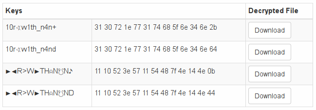

# 12 - Decrypt0r

Crack the mighty **Decryt0r** and make it write a text with a flag.

No Easter egg here. Enter the flag directly on the flag page.

[decryptor.zip](files/decryptor.zip)

### Solution

Provided ZIP archive contained a non-stripped 64-bit ELF binary.

```
$ unzip decryptor.zip 
Archive:  decryptor.zip
  inflating: decryptor 
$ file decryptor
decryptor: ELF 64-bit LSB executable, x86-64, version 1 (SYSV), dynamically linked, interpreter /lib64/ld-linux-x86-64.so.2, for GNU/Linux 3.2.0, BuildID[sha1]=1835d7dad4e2511aef2328a6fc9a2bb17f36f4e6, with debug_info, not stripped
```

As a first step I decompiled it using RetDec

```c
int64_t _Z4hashPj(int64_t * a1) {
    int64_t str = (int64_t)a1; // 0x40065f
    int64_t * mem = malloc(845); // 0x400668
    uint32_t v1 = strlen((char *)str) - 1; // 0x40067d
    int64_t result = (int64_t)mem; // 0x400683

    for (int64_t i = 0; i < 211; i++) {
        int64_t v2 = 4 * i; // 0x400712

        for (int64_t j = 0; j < 4; j++) {
            int64_t v3 = j + v2;
            char v4 = *(char *)((int64_t)((int32_t)v3 % v1) + str); // 0x4006fb
            *(char *)(v3 + result) = v4;
        }

        int32_t * v5 = (int32_t *)(v2 + result); // 0x400721
        int32_t v6 = *v5; // 0x400721
        int32_t v7 = *(int32_t *)(v2 + (int64_t)&g1); // 0x400737
        int32_t v8 = -1 - (v7 & v6); // 0x4007a7
        *v5 = -1 - (-1 - (v8 & v6) & -1 - (v8 & v7));
    }
    
    return result;
}

int main(int argc, char ** argv) {
    printf("Enter Password: ");
    int64_t passwd; // bp-24
    fgets((char *)&passwd, 16, g2);
 
    int64_t decrypted = _Z4hashPj(&passwd); // 0x400872
    printf((char *)decrypted);
 
    return 0;
}
```

Since it wasn't immediately clear to me what was going on there I reimplemented the `_Z4hashPj` function in Scala.

```scala
def decrypt(data: Array[Byte], passwd: String): Array[Byte] = {
  val block_size = 4
  val blocks = data.grouped(block_size)

  blocks.zipWithIndex.flatMap { case (block, i) =>
    val passwd_block = BigInt((0 until block_size).map(j => passwd((block_size * i + j) % passwd.length).toByte).toArray)
    val crypted_block = BigInt(block)
    val decrypted_block = -1 - (-1 - ((-1 - (crypted_block & passwd_block)) & passwd_block) & -1 - ((-1 - (crypted_block & passwd_block)) & crypted_block))
    decrypted_block.toByteArray
  }.toArray
}
```

After staring at the code for a while I realized that the expression at the end of the method can be simplified using this simple formula `~x = -1 - x` for bitwise complement. That gave me:

```scala
val decrypted_block = ~(~(~(crypted_block & passwd_block) & passwd_block) & ~(~(crypted_block & passwd_block) & crypted_block))
```

It started to look understandable. I simplified the expression once more using another formula `a ^ b = ~(~(~(a & b) & a) & ~(~(a & b) & b))` for XOR. The result was simple enough:

```scala
val decrypted_block = crypted_block ^ passwd_block
```

I extracted [encrypted data](files/flag.encrypted) from the ELF binary and let [XOR Cracker](https://wiremask.eu/tools/xor-cracker/) do his job. The most probable length of the password was 13 with probability of 22.9%. The cracker suggested me few possible passwords:



The second one immediately caught my attention. It was really close. Now it was a no-brainer to correct it using the context. The right password was `x0r_w1th_n4nd` - XOR with NAND in leetspeak.

```
$ ./decryptor
Enter Password: x0r_w1th_n4nd
Hello,
congrats you found the hidden flag: he19-Ehvs-yuyJ-3dyS-bN8U.

'The XOR operator is extremely common as a component in more complex ciphers. By itself, using a constant repeating key, a simple XOR cipher can trivially be broken using frequen
cy analysis. If the content of any message can be guessed or otherwise known then the key can be revealed.'
(https://en.wikipedia.org/wiki/XOR_cipher)

'An XOR gate circuit can be made from four NAND gates. In fact, both NAND and NOR gates are so-called "universal gates" and any logical function can be constructed from either NA
ND logic or NOR logic alone. If the four NAND gates are replaced by NOR gates, this results in an XNOR gate, which can be converted to an XOR gate by inverting the output or one
of the inputs (e.g. with a fifth NOR gate).'
(https://en.wikipedia.org/wiki/XOR_gate)
```

### Flag

```
he19-Ehvs-yuyJ-3dyS-bN8U
```
