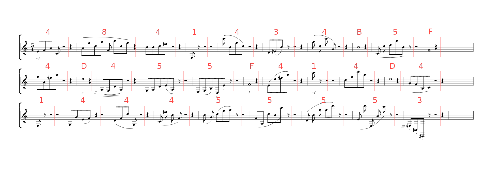
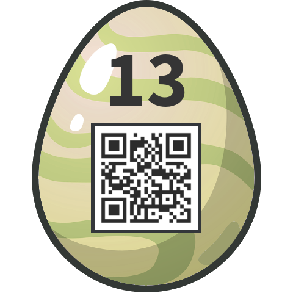

# 13 - Symphony in HEX

A lost symphony of the genius has reappeared.

Hint: count quavers, read semibreves

Once you found the solution, enter it in the *egg-o-matic* below. **Uppercase only**, and **no spaces**!

### Solution

I split the score by rests into 30 blocks, each representing a single hexadecimal digit. Blocks consisting of quavers were converted to digits simply by counting total number of quavers in given block, blocks consisting of semibrave were converted by reading the note letter.

That gave me 15 bytes long hexadecimal value `48 41 43 4B 5F 4D 45 5F 41 4D 41 44 45 55 53` which I converted to ASCII. 

Password: `HACK_ME_AMADEUS`

### Egg

