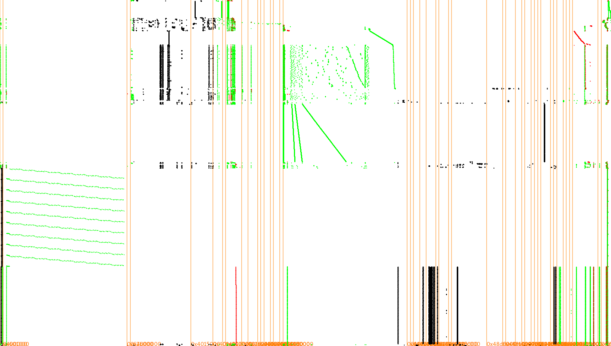

# 14 - White Box

Do you know the mighty **WhiteBox** encryption tool? Decrypt the following cipher text!

```
9771a6a9aea773a93edc1b9e82b745030b770f8f992d0e45d7404f1d6533f9df348dbccd71034aff88afd188007df4a5c844969584b5ffd6ed2eb92aa419914e
```

[WhiteBox](files/WhiteBox)

### Solution

Provided binary was a stripped 64-bit ELF executable.

```
$ file WhiteBox
WhiteBox: ELF 64-bit LSB executable, x86-64, version 1 (SYSV), dynamically linked, interpreter /lib64/ld-linux-x86-64.so.2, for GNU/Linux 3.2.0, BuildID[sha1]=0077413b3a5ad4d245339f092e46d64e547155f0, stripped
```

I tried to execute it first. It asked me to enter a message and then printed the encrypted message to the standard output.

```
$ ./WhiteBox 
WhiteBox Test
Enter Message to encrypt: ohai!
9d4298dbceb05ad016db8cbea05d3db7
```

I decompiled it with IDA to get some high-level information about the cipher used. I started with the `main` function and tried to identify purpose of all the functions and local variables and rename them to make the code more understandable. This was the result. 

```c
__int64 __fastcall main(__int64 a1, char **a2, char **a3) {
  char plaintext[524]; // [rsp+10h] [rbp-220h]
  int padding_length; // [rsp+21Ch] [rbp-14h]
  int num_of_16_blocks; // [rsp+220h] [rbp-10h]
  int plaintext_length; // [rsp+224h] [rbp-Ch]
  int j; // [rsp+228h] [rbp-8h]
  int i; // [rsp+22Ch] [rbp-4h]

  puts("WhiteBox Test");
  printf("Enter Message to encrypt: ", a2);
  fgets(plaintext, 512, stdin);
  
  plaintext_length = strlen(plaintext) - 1;
  num_of_16_blocks = plaintext_length / 16 + 1;
  padding_length = 16 - plaintext_length % 16;
  
  // append block padding
  for (i = 0; i < padding_length; ++i)
    plaintext[i + plaintext_length] = padding_length;
    
  // encrypt block by block
  for (j = 0; j < num_of_16_blocks; ++j)
    encrypt_block((__int64) &plaintext[16 * j]);
  
  print_hexed((__int64) plaintext, 16 * num_of_16_blocks);
  putchar(10);
  return 0LL;
}
```

I learned that it's a block cipher using 128-bit blocks and PKCS padding. My instant guess was that it's AES-128 cipher. That was a promising start.

Since it was explicitly stated that it's a [white box crypto](http://www.whiteboxcrypto.com/) I gave up on trying to understand the rest of the decompiled code to extract the encryption key. Instead I followed this tutorial on [how to crack a white-box without much effort](https://insinuator.net/2016/03/how-to-crack-a-white-box-without-much-effort/).

The first step was to trace the executable using Valgrind plugin called [TracerGrind](https://github.com/SideChannelMarvels/Tracer/tree/master/TracerGrind).

```
$ valgrind --tool=tracergrind --output=WhiteBox.traces ./WhiteBox < input.txt 
==16942== TracerGrind-1.4, TracerGrind tracing tool
==16942== Charles Hubain
==16942== Using Valgrind-3.12.0 and LibVEX; rerun with -h for copyright info
==16942== Command: ./WhiteBox
==16942== 
==16942== Ooops that's a dirty c call ...
==16942== Ooops that's a dirty c call ...
WhiteBox Test
Enter Message to encrypt: 1de5384f983f62af42a15a49f9f72e303920d6a772496a624894fea52a3f36a4a75d728768c3a5a18b05880614ade2ea3d6be50a366f252664a431b019d74a5b627eaa828992f3f77cd0d75bed47cf46eb0e5d602dda071eaaada0d2473885655ddc46b333a9bc86a2bb94111c167e81ecb68b289af84761403518962c9ea9e667160e5673ae393ce6c5fb77a8d7eb44
==16942==
$ sqlitetrace WhiteBox.traces WhiteBox.sqlite
```

Then I visualized the traces.

```
$ tracegraph WhiteBox.sqlite
```



I continued with my research and discovered another very useful [SideChannelMarvels](https://github.com/SideChannelMarvels)' repository called [Deadpool](https://github.com/SideChannelMarvels/Deadpool) which contained various public white-box cryptographic implementations and their practical attacks. Luckily I noticed that my traces looked pretty similar to the traces from [SECCON 2016 challenge](https://github.com/SideChannelMarvels/Deadpool/tree/master/wbs_aes_seccon2016) which confirmed my previous guess.

After this discovery I simply followed provided [Differential Fault Analysis](https://github.com/SideChannelMarvels/Deadpool/blob/master/README_dfa.md) attack [example](https://github.com/SideChannelMarvels/Deadpool/tree/master/wbs_aes_seccon2016/DFA) for this challenge. I cloned both [Deadpool](https://github.com/SideChannelMarvels/Deadpool) and [JeanGrey](https://github.com/SideChannelMarvels/JeanGrey) repositories and modified example attack scripts to fit my needs.

This was my `attack_whitebox.py` script.

```python
#!/usr/bin/env python3

import deadpool_dfa
import phoenixAES
import struct
import re

def processinput(iblock, blocksize):
    return (bytes.fromhex('%0*x' % (2*blocksize, iblock)), None)

def processoutput(output, blocksize):
    result = re.search('Enter Message to encrypt: ([0-9a-f]+)', output.decode()).group(1)
    return int(result, 16)

engine=deadpool_dfa.Acquisition(targetbin='./WhiteBox', targetdata='./WhiteBox', goldendata='./WhiteBox.gold',
        dfa=phoenixAES, processinput=processinput, processoutput=processoutput, verbose=2, minleaf=1, minleafnail=1)

tracefiles_sets=engine.run()
for tracefile in tracefiles_sets[0]:
    if phoenixAES.crack_file(tracefile):
        break
```

And this was the Bash script I used to prepare the environment for my attack script including a `tmpfs` volume to speed up disk write operations. 

```bash
#!/bin/bash

mkdir -p tmp
mount | grep -q $(pwd)/tmp || mount -t tmpfs -o mode=01777,size=50m tmpfs tmp
cp attack_whitebox.py ../../Deadpool/deadpool_dfa.py tmp
cp ../../JeanGrey/phoenixAES/phoenixAES/__init__.py tmp/phoenixAES.py
cp ../../WhiteBox tmp
cp ../../WhiteBox tmp/WhiteBox.gold
cd tmp
./attack_whitebox.py
```

All the scripts I prepared for my attack can be found in the [DFA](files/DFA) folder.

I ran my script and waited for the result.

```
$ cd DFA/
$ ./mount_tmp_and_attack.sh
... (snip) ...
Saving 17 traces in dfa_enc_20190429_060317-060415_17.txt
Last round key #N found:
FD83DB41AC158393CC291088B76F201A
```

It worked like a charm and discovered the last round key. To get the encryption key I was looking for I cloned [Stark](https://github.com/SideChannelMarvels/Stark) repository and compiled `aes_keyschedule` tool from it.

```
$ ./aes_keyschedule FD83DB41AC158393CC291088B76F201A 10
K00: 336D62336E6433645F6B33795F413335
K01: B1AEF4FCDFCAC79880A1F4E1DFE0C7D4
K02: 5268BC628DA27BFA0D038F1BD2E348CF
K03: 473A36D7CA984D2DC79BC23615788AF9
K04: F344AF8E39DCE2A3FE472095EB3FAA6C
K05: 96E8FF67AF341DC451733D51BA4C973D
K06: 9F60D8933054C5576127F806DB6B6F3B
K07: A0C83A2A909CFF7DF1BB077B2AD06840
K08: 508D33CFC011CCB231AACBC91B7AA389
K09: 91879460519658D2603C931B7B463092
K10: FD83DB41AC158393CC291088B76F201A
```

That gave me the right decryption key: `336D62336E6433645F6B33795F413335`.

To decrypt the provided ciphertext I used this online [tool](http://aes.online-domain-tools.com/). The decrypted message was:

```
Congrats! Enter whiteboxblackhat into the Egg-o-Matic!
```

### Egg


