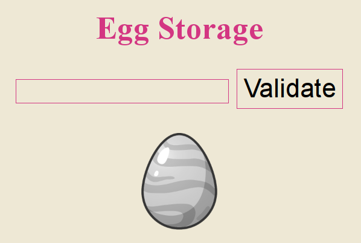

# 18 - Egg Storage

Last year someone stole some eggs from Thumper.

This year he decided to use cutting edge technology to protect his eggs.

[Egg Storage](https://hackyeaster.hacking-lab.com/hackyeaster/challenges/eggstorage/index.html)

### Description

Provided link brought you to a page with a simple validation form.



### Solution

I displayed the source code of the page and noticed that it contained an embedded [script](files/egg18.js). Its responsibility was to initialize the WebAssembly form validator.

I extracted the WebAssembly [binary](files/egg18.wasm) and decompiled it with trial version of [JEB for WebAssembly](https://www.pnfsoftware.com/jeb/demowasm). This was the result decompiled [C code](files/egg18.c) with some auxiliary comments added.

```c
int validatePassword(unsigned int param0, unsigned int param1, unsigned int param2, unsigned int param3, int param4, unsigned int param5, int param6, int param7, int param8, int param9, unsigned int param10, int param11, unsigned int param12, int param13, unsigned int param14, unsigned int param15, unsigned int param16, unsigned int param17, unsigned int param18, unsigned int param19, unsigned int param20, unsigned int param21, int param22, int param23) {
    functions();
    *24 = param0;
    *25 = param1;
    *26 = param2;
    *27 = param3;
    *28 = param4;
    *29 = param5;
    *30 = param6;
    *31 = param7;
    *32 = param8;
    *33 = param9;
    *34 = param10;
    *35 = param11;
    *36 = param12;
    *37 = param13;
    *38 = param14;
    *39 = param15;
    *40 = param16;
    *41 = param17;
    *42 = param18;
    *43 = param19;
    *44 = param20;
    *45 = param21;
    *46 = param22;
    *47 = param23;
    int i = 4;

    do {
        // check if letters in { 48, 49, 51, 52, 53, 72, 76, 88, 99, 100, 102, 114 } ~ "01345HLXcdfr"
        int valid = validateRange(((unsigned int)(*(i + 24))));
        if (valid == 0) {
            return 0;
        }
        else {
            ++i;
        }
    } while (param23 <= 24);

    if (param0 != 84) { // p0 == 84 ~ 'T'
        return 0;
    }
    else if (param1 != 104) { // p1 == 104 ~ 'h'
        return 0;
    }
    else if (param2 != 51) { // p2 == 51 ~ '3'
        return 0;
    }
    else if (param3 != 80) { // p3 = 80 ~ 'P'
        return 0;
    }
    else if (param17 != param23) { // p17 == p23
        return 0;
    }
    else if (param12 != param16) { // p12 == p16
        return 0;
    }
    else if (param15 != param22) { // p15 == p22
        return 0;
    }
    else if (param5 - param7 != 14) { // p5 == p7 + 14
        return 0;
    }
    else if (param14 + 1 != param15) { // p15 == p14 + 1
        return 0;
    }
    else if (param9 % param8 != 40) { // p9 % p8 == 40
        return 0;
    }
    else if (param5 - param9 + param19 != 79) { // p5 == 79 + p9 - p19
        return 0;
    }
    else if (param7 - param14 != param20) { // p7 == p20 + p14
        return 0;
    }
    else if (param9 % param4 * 2 != param13) { // p9 % p4 * 2 = p13
        return 0;
    }
    else if (param13 % param6 != 20) { // p13 % p6 == 20
        return 0;
    }
    else if (param21 - 46 != param11 % param13) { // p21 - 46 == p11 % p13
        return 0;
    }
    else if (param7 % param6 != param10) { // p7 & p6 == p10
        return 0;
    }
    else if (param23 % param22 != 2) { // p23 % p22 == 2
        return 0;
    }
    else {
        i = 4;
        unsigned int v2 = 0, v3 = 0;

        do {
            v2 += (unsigned int)(*(i + 24));
            v3 ^= (unsigned int)(*(i + 24));
            ++i;
        } while (i <= 24);

        if (v2 != 1352) {
            return 0;
        }
        else {
            if (v3 != 44) {
                return 0;
            }

            decrypt();
            return 1;
        }
    }
}

int validateRange(unsigned int param0) {
    if ((((unsigned int)(param0 == 48)) | ((unsigned int)(param0 == 49)) | ((unsigned int)(param0 == 51)) | ((unsigned int)(param0 == 52)) | ((unsigned int)(param0 == 53)) | ((unsigned int)(param0 == 72)) | ((unsigned int)(param0 == 76)) | ((unsigned int)(param0 == 88)) | ((unsigned int)(param0 == 99)) | ((unsigned int)(param0 == 100)) | ((unsigned int)(param0 == 102)) | ((unsigned int)(param0 == 114)))) {
        return 1;
    }
    else {
        return 0;
    }
}

int decrypt() {
    do {
        *ptr0 = (unsigned char)(((unsigned int)(*(ptr0 + 6))) ^ ((unsigned int)(*ptr0)));
        ptr0 = (int*)(((char*)ptr0) + 1);
    } while (((unsigned char)(((int)ptr0) <= 24)));

    return 1337;
}
```

From the code I gathered lot of useful information. The password should be 24 characters long and based on the limited alphabet `01345HLXcdfr`. These were the constraints of the individual password characters.

```
p[0] = 84
p[1] = 104
p[2] = 51
p[3] = 80
p[17] = p[23]
p[12] = p[16]
p[15] = p[22]
p[5] = p[7] + 14
p[15] = p[14] + 1
p[9] % p[8] = 40
p[5] = 79 + p[9] - p[19]
p[7] = p[20] + p[14]
p[9] % p[4] * 2 = p[13]
p[13] % p[6] = 20
p[21] - 46 = p[11] % p[13]
p[7] & p[6] = p[10]
p[23] % p[22] = 2
```

I solved most of the characters manually. This was the result.

```
p[0] = 'T'
p[1] = 'h'
p[2] = '3'
p[3] = 'P'
p[4] = '4'
p[5] = 'r'
p[6] = '4'
p[7] = 'd'
p[8] = '0'
p[9] = 'X'
p[10] = '0'
p[11] = ???, (p[11], p[21]) in { ('5', 'c'), ('f', 'L'), ('r', 'X') }
p[12] = ???
p[13] = 'H'
p[14] = '0'
p[15] = '1'
p[16] = p[12]
p[17] = p[23]
p[18] = ???
p[19] = '5'
p[20] = '4'
p[21] = ???, (p[11], p[21]) in { ('5', 'c'), ('f', 'L'), ('r', 'X') }
p[22] = '1'
p[23] = ???, p[23] in { '3', 'd' }
```

For the rest I wrote a simple Scala [program](../../src/main/scala/hackyeaster2019/Egg18.scala) which brute-forced all remaining combination of the password and found the right one based on two checksums from the WebAssembly code.

```scala
val alphabet = "01345HLXcdfr"

val candidates = for (
  (p11, p21) <- Seq(('5', 'c'), ('f', 'L'), ('r', 'X'));
  p12 <- alphabet;
  p18 <- alphabet;
  p23 <- Seq('3', 'd')
) yield s"Th3P4r4d0X0${p11}${p12}H01${p12}${p23}${p18}54${p21}1${p23}"

val password = candidates.find { passwd =>
  val checksum = passwd.substring(4).foldLeft((0, 0)) { (a, c) => (a._1 + c, a._2 ^ c) }
  checksum == (1352, 44)
}.orNull

println(password)

```

Password: `Th3P4r4d0X0fcH01c3154L13`

### Egg


