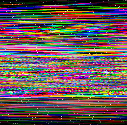

# 20 - Scrambled Egg

This Easter egg image is a little distorted...

Can you restore it?


### Solution

If you zoomed the image you immediately spotted some transparent pixels in it. More interestingly each row of the image contained exactly three of them. I focused on those pixels and wrote a Scala program which printed their RGB values.

```scala
val scrambled = ImageIO.read(Paths.get("hackyeaster2019/challenges/egg20/files/egg-scrambled.png").toFile)

println(pixelsOf(scrambled).map(_.filter(_.getAlpha == 0).map(toString).mkString(", ")).mkString("\n"))

def toString(color: Color) = "(%3d, %3d, %3d)".format(color.getRed, color.getGreen, color.getBlue)

def pixelsOf(image: BufferedImage): Array[Array[Color]] = {
  val width = image.getWidth
  val height = image.getHeight

  val pixels = Array.ofDim[Color](height, width)
  for (y <- 0 until height) {
    for (x <- 0 until width) {
      pixels(y)(x) = new Color(image.getRGB(x, y), true)
    }
  }

  pixels
}
```

It printed following output.

```
(  0,  23,   0), ( 23,   0,   0), (  0,   0,  23)
(  0, 214,   0), (214,   0,   0), (  0,   0, 214)
(  0,   0, 175), (  0, 175,   0), (175,   0,   0)
(223,   0,   0), (  0, 223,   0), (  0,   0, 223)
(  0,  53,   0), ( 53,   0,   0), (  0,   0,  53)
(  0,   0,  46), ( 46,   0,   0), (  0,  46,   0)
(187,   0,   0), (  0, 187,   0), (  0,   0, 187)
(  0,   0, 205), (  0, 205,   0), (205,   0,   0)
(  0,   0, 106), (106,   0,   0), (  0, 106,   0)
(  0,   0, 150), (150,   0,   0), (  0, 150,   0)
(  0, 155,   0), (155,   0,   0), (  0,   0, 155)
( 89,   0,   0), (  0,   0,  89), (  0,  89,   0)
( 71,   0,   0), (  0,   0,  71), (  0,  71,   0)
(159,   0,   0), (  0, 159,   0), (  0,   0, 159)
(  0,  99,   0), (  0,   0,  99), ( 99,   0,   0)
(123,   0,   0), (  0, 123,   0), (  0,   0, 123)
(  0,   0,  74), ( 74,   0,   0), (  0,  74,   0)
( 93,   0,   0), (  0,   0,  93), (  0,  93,   0)
(  0,   0, 196), (  0, 196,   0), (196,   0,   0)
(  0, 160,   0), (160,   0,   0), (  0,   0, 160)
(  0,   0, 222), (222,   0,   0), (  0, 222,   0)
(  0,   0,  88), (  0,  88,   0), ( 88,   0,   0)
(  0, 118,   0), (118,   0,   0), (  0,   0, 118)
(  0,  87,   0), ( 87,   0,   0), (  0,   0,  87)
(  0, 217,   0), (  0,   0, 217), (217,   0,   0)
( 98,   0,   0), (  0,   0,  98), (  0,  98,   0)
(  0,   0, 145), (  0, 145,   0), (145,   0,   0)
( 31,   0,   0), (  0,  31,   0), (  0,   0,  31)
... (snip) ...
```

Each transparent pixel of the row represented one RGB component. The value of these three components had the same unique value for each row and represented the position of the row in the original image. I modified my program to reorder rows to the original order.

```scala
val scrambled = ImageIO.read(Paths.get("hackyeaster2019/challenges/egg20/files/egg-scrambled.png").toFile)

val pixels = pixelsOf(scrambled)
val ordered = pixels.sortBy(_.find(c => c.getAlpha == 0 && c.getRed > 0).map(_.getRed).getOrElse(0))

ImageIO.write(imageOf(ordered), "png", Paths.get("hackyeaster2019/challenges/egg20/files/egg-ordered.png").toFile)

def pixelsOf(image: BufferedImage): Array[Array[Color]] = {
  val width = image.getWidth
  val height = image.getHeight

  val pixels = Array.ofDim[Color](height, width)
  for (y <- 0 until height) {
    for (x <- 0 until width) {
      pixels(y)(x) = new Color(image.getRGB(x, y), true)
    }
  }

  pixels
}

def imageOf(pixels: Array[Array[Color]]): BufferedImage = {
  val height = pixels.length
  val width = pixels.head.length

  val image = new BufferedImage(width, height, BufferedImage.TYPE_INT_ARGB)
  for (y <- 0 until height) {
    for (x <- 0 until width) {
      image.setRGB(x, y, pixels(y)(x).getRGB)
    }
  }

  image
}
```

I got this picture which was still far from the original. The rows were still somehow shifted.



Once again I extended my program to handle those shifts. I split each row into RGB components, shifted them separately by the position of the component's transparent pixel and them merged them back into a single new row using full RGB colorspace.    

```scala
val scrambled = ImageIO.read(Paths.get("hackyeaster2019/challenges/egg20/files/egg-scrambled.png").toFile)

val pixels = pixelsOf(scrambled)
val ordered = pixels.sortBy(_.find(c => c.getAlpha == 0 && c.getRed > 0).map(_.getRed).getOrElse(0))

val shifted = ordered.map { row =>
  def shiftedChannelOf(extract: Color => Int): Array[Int] = {
    val n = row.indexWhere(c => c.getAlpha == 0 && (extract(c) > 0 || (c.getRGB == 0)))
    shiftLeft(row, n).filter(_.getAlpha > 0).map(extract)
  }

  val red = shiftedChannelOf(_.getRed)
  val green = shiftedChannelOf(_.getGreen)
  val blue = shiftedChannelOf(_.getBlue)

  (red, green, blue).zipped.map { case (r, g, b) => new Color(r, g, b) }
}

ImageIO.write(imageOf(shifted), "png", Paths.get("hackyeaster2019/challenges/egg20/files/egg.png").toFile)

def shiftLeft(row: Array[Color], n: Int) = {
  assert(n >= 0 && n < row.length)
  row.slice(n, row.length) ++ row.slice(0, n)
}

def pixelsOf(image: BufferedImage): Array[Array[Color]] = {
  val width = image.getWidth
  val height = image.getHeight

  val pixels = Array.ofDim[Color](height, width)
  for (y <- 0 until height) {
    for (x <- 0 until width) {
      pixels(y)(x) = new Color(image.getRGB(x, y), true)
    }
  }

  pixels
}

def imageOf(pixels: Array[Array[Color]]): BufferedImage = {
  val height = pixels.length
  val width = pixels.head.length

  val image = new BufferedImage(width, height, BufferedImage.TYPE_INT_RGB)
  for (y <- 0 until height) {
    for (x <- 0 until width) {
      image.setRGB(x, y, pixels(y)(x).getRGB)
    }
  }

  image
}
```

This transformation finally reverted the image to its original form.

The complete source code of my solver can be found [here](../../src/main/scala/hackyeaster2019/Egg20.scala).

### Egg


