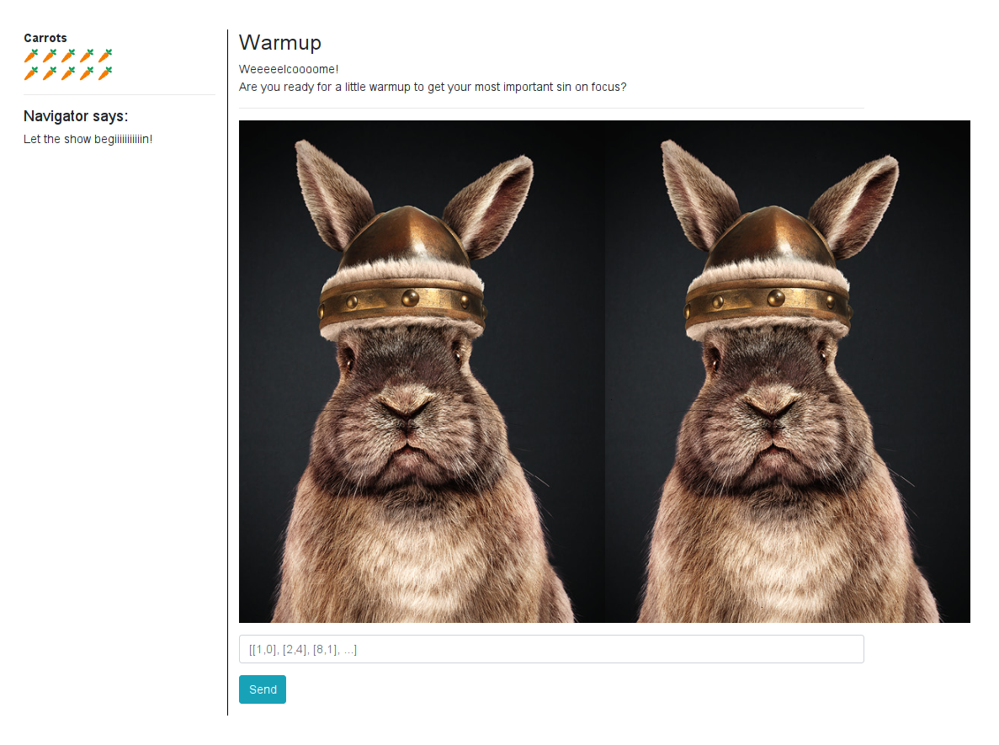
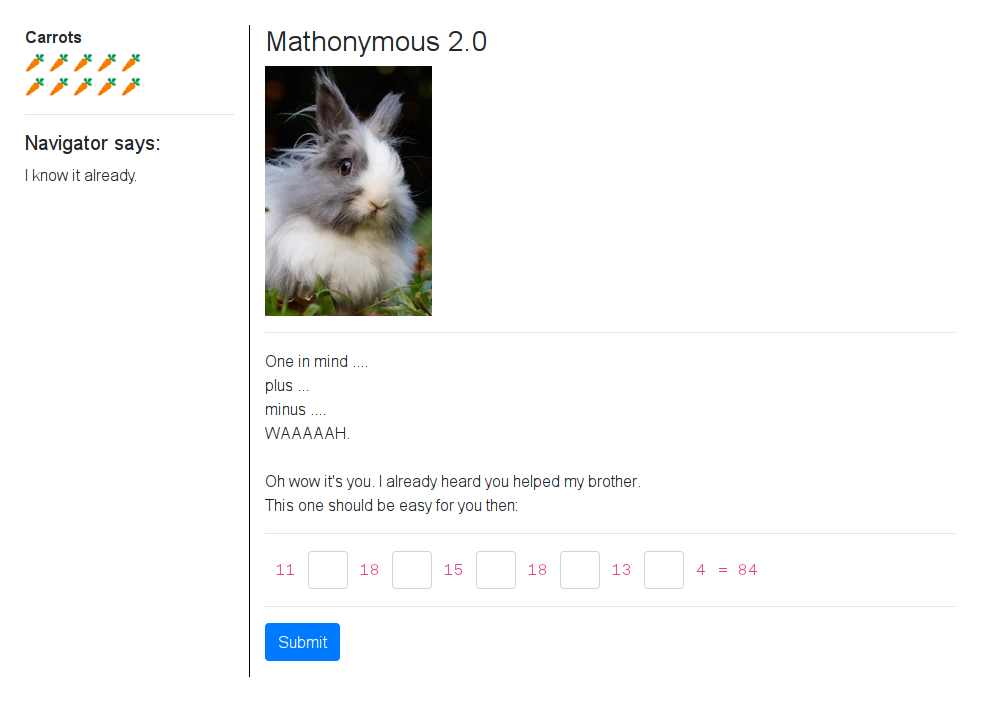
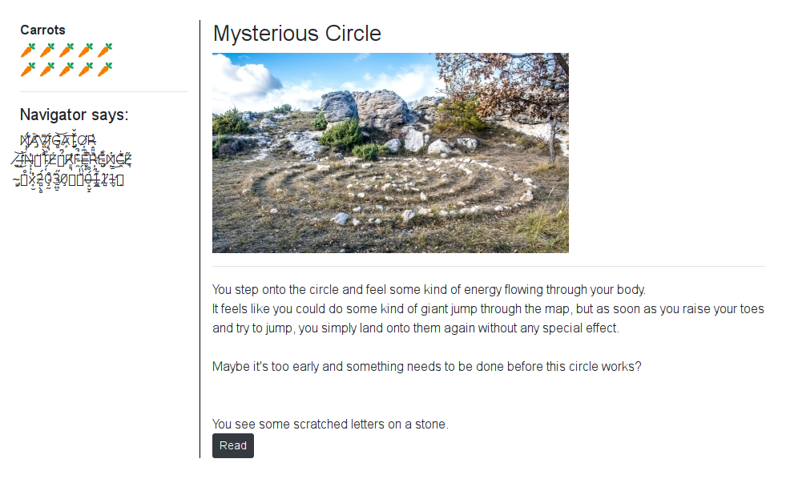

# 21 - The Hunt: Misty Jungle

Welcome to the longest scavenger hunt of the world!

The hunt is divided into two parts, each of which will give you an Easter egg. Part 1 is the **Misty Jungle**.

To get the Easter egg, you have to fight your way through a maze. On your journey, find and solve **8** mini challenges, then go to the exit. Make sure to check your carrot supply! Wrong submissions cost one carrot each.

[Start the hunt](http://whale.hacking-lab.com:5337/)

### Description

The target site provided me these simple instructions:

> *Click the buttons on the left to get some basic help.* 
>
> *What you are seeing is your navigator interface. This is the only option to interact with the environment. Since we are in an early stage of this new feature, we can't provide you any graphical interface right now. But you are smart (this is why you choosed us!) and will figure it out quickly.*
> 
> *You got it. What would be an exciting trip without the option to move and visit all the nice places we promised you?*
> 
> ``` ``bqq`vsm``0npwf0y0z ```
> 
> *You might meet other visitor during your travel. Some really take a lot of time in there to see our whole effort in detail.*
>  
> *But I promise - everyone is nice in there and will love to meet you! 😈*

### Solution

The first thing I had to do was to figure out how to move. The key was to decode the ``` ``bqq`vsm``0npwf0y0z ``` string. I displayed source code of the page and found this `script` element.

```html
<script type='text/javascript'>
    // add all this variables later
    let youCanTouchThis = "";
    let youCantTouchThis = "";
    let randomNumber = undefined;

    for (let i = 0; i < youCantTouchThis.length; i++) {
        if (youCantTouchThis.charCodeAt(i) === 28) {
            youCanTouchThis += '&';
        } else if (youCantTouchThis.charCodeAt(i) === 23) {
            youCanTouchThis += '!';
        } else {
            youCanTouchThis += String.fromCharCode(youCantTouchThis.charCodeAt(i) - randomNumber);
        }
    }
    // document.write(m);
</script>
``` 

I used it to decode the encoded hint which gave me `__app_url__/move/x/y` for `randomNumber` equal to 1.

To make things easier I wrote The Hunt Maze [client](../../src/main/scala/hackyeaster2019/tools/TheHuntMaze.scala) in Scala which I later reused for the second part of The Hunt: [Muddy Quagmire](../egg22/README.md). The whole application state was stored in the encrypted session cookie so I could restore any previous state using the `init` method. It was very useful feature.

I used the client to manually explore the maze to get a map with position of the mini challenges. This maze had two stages. You had to complete all the mini challenges in the first stage to unlock the second stage.

#### Stage 1

Here is an ASCII version of the map of the first stage. Starting position is marked by `@` and position of the mini challenges by `¤` character.

```
░░░░░░░░░░░░░░░░░░░░░░░░░░░░░░░
░░░░░░░░█░░█░░░█░░░█░░██░█░██░░
░░░░░░░█ ██ █░█¤█░█ ██  █ █ ¤█░
░░░░░░░█ █   █   █   █       █░
░░░░░░░█   █   █   █   █████ █░
░░░░░░░█  █░█ █░█ █░██       █░
░░░░░░░█   █   █   █░█  █  ¤ █░
░░██████ █ █ █ █ █ █░█  █    █░
░█         █   █   █░░██░████░░
░█¤████████░███░███░░░░░░░░░░░░
░█ █░░░░░░░░░░░░░░░░░░░░░░░░░░░
░█ █░░░░░░░░░░░░░░░░░░░░░░░░░░░
░█ █░░░░░░░░░░░░░░░░░░░░░░░░░░░
░█ █░░░░░░░░░░░░░░░░░░░░░░░░░░░
░█ █░░░░░░░░░░░░░░░░░░░░░░░░░░░
░█ █░░░░░░░░░░░░░░░░░░░░░░░░░░░
░█@█░░░░░░░░░░░░░░░░░░░░░░░░░░░
░░█░░░░░░░░░░░░░░░░░░░░░░░░░░░░
░░░░░░░░░░░░░░░░░░░░░░░░░░░░░░░
```

##### Warmup



The two images looked the same but some of the pixels were different. You were supposed to find all `[x,y]` positions of those pixels. It was easy to write a [script](../../src/main/scala/hackyeaster2019/Egg21Warmup.scala) to do that, but the submit form did not validate the input so you could submit any string.

```scala
val dir = Paths.get("hackyeaster2019/challenges/egg21/files/warmup")

val left = ImageIO.read(dir.resolve("c11.png").toFile)
val right = ImageIO.read(dir.resolve("75687138-87d0-4c78-b2e3-f335acf76f15.png").toFile)

println(differences)

def differences: String = {
  assert(left.getWidth == right.getWidth && left.getHeight == right.getHeight)

  val pixels = for (x <- 0 until left.getWidth; y <- 0 until left.getHeight) yield (x, y)
  val differences = pixels.filter { case (x, y) => left.getRGB(x, y) != right.getRGB(x, y) }

  differences.map(t => s"[${t._1},${t._2}]").mkString("[", ", ", "]")
}
```

The result:

```
[[8,368], [37,95], [207,642], [252,55], [258,557], [278,49], [289,16], [353,315], [358,249], [418,29]]
```

##### Mathonymous 2.0



You had to find the right arithmetic operators to put in the blank boxes to make the math expression correct. To solve this challenge, I wrote a [script](../../src/main/scala/hackyeaster2019/Egg21Mathonymous.scala) to bruteforce the combination.

```scala
val toolbox = currentMirror.mkToolBox()

val ops = List("+", "-", "*", "/")
val solution = for {
  op1 <- ops; op2 <- ops; op3 <- ops; op4 <- ops; op5 <- ops
  if eval(s"11 $op1 18 $op2 15 $op3 18 $op4 13 $op5 4") == 84
} yield s"11 $op1 18 $op2 15 $op3 18 $op4 13 $op5 4 = 84"

println(solution)

def eval(expr: String): Int = {
  toolbox.eval(toolbox.parse(expr)).asInstanceOf[Int]
}
```

The result:

```
11 + 18 - 15 + 18 + 13 * 4 = 84
```

##### C0tt0nt4il Ch3ck V2.0


Here you had to solve a math expression captcha in time. I noticed that UUID-like format of the captcha image names contained the right answer in the third ID part.

For example: [bd1adcff-67ea-**124**-8edf-37663d12dc63.png](http://whale.hacking-lab.com:5337/static/img/ch12/challenges/bd1adcff-67ea-124-8edf-37663d12dc63.png) -> 124

I wrote a simple jQuery script to extract the result and submit it.

```javascript
var result = $('#captcha').attr('src').split('-')[2];
$('input[type="text"]').val(result);
$('input[type="submit"]').click();
```

##### Mysterious Circle



This was just a teleport to the second stage of the maze. Once you completed all the mini challenges in this stage, navigator message changed to:

> S̶̡̛̛̰̠̩͇̯̮͌͌̈́̐͜o̷̘̼̘͍̅͊̊m̷̲̼̰̙͓̼̳̺̃̃̐̀̕ẹ̸̘͈̲͕̞̏͌͑͜t̶̠̱̀ͅh̵̨̛͎̘̠̗̥̣̱̠͉̓̂̋̈́́͗̕̚͠į̶̛͈̩͔̮͎͉̥͔́̋̇͊̾͋́̀̕n̶̺̈́̈́͑̅̾͊̕͘̕ĝ̷̩̲͓̥͉̤̯͇̐́̀͠͠ ̴̱̩̏̔̿̆̈́̿̌̌́̚s̶̮̽t̵̨̘̠̹̮̖̎̔̀͗̐̒̕r̴̢͚̠̘̪̤̺͓͒̋͒a̸̜̋̉̑̓͐̆̓̕n̴̡͚͚͉̦̫̻͋̌̇̊̒̔͜g̸͙̳̦̘̅͜e̴̛̮̹̰͔̬̖̞̱͎̭̿͌̋̂͠ ̶̰̮͔̯̩̩̲͇̃͗͌̈́̆̿̕̕h̷̢̨̢̢̞̪͆̎̉̽̆͗a̷̺̍̄̐̔̑͘̕p̷̨̝͙͇͙̫͖̌̌͂͋͛͐̌͘ͅp̵̧͖͈͌͆̔̑̇͂̈́͘e̸͍̫͇͗̈́̚n̵̡̧͎͉̦̫̽͗̔̀̍̋e̸̢̢̦̙̟͍͔̱̾̈͊͊͝d̷̰̺̟͕̝͋́́̈.̶̧̨̛͍̺̱͎͖̖̭̪̋̿̓̀͗̌̃͘ ̶̨̛͚̰̖͕͜Ȳ̶͈̻̤̥̗̔̊̚ò̶̤̩̝̗̘̗̾̒̾̂͠ú̷͍̩̲̯̟ ̷͇͔̰͍͙̖͖̙̈͗́̓̾s̷̡̨͖̩̹͉͜͠ȩ̸̢͙̰̳͌ĕ̵̪͋̔m̵̢̨̼͙̼͓̣̟͒̈̆̽̌̉͆̊̍̚͜ͅ ̶̨̝̭͍̽ͅt̶̡̜̹̬̫̞̳̮̽̏̂ͅơ̴̢̩̖̤̎͆̕͠ ̴̛̝̦͛̊̾̕̚͝b̴̗̂̒͌͐͘͝ĕ̸͕͂̿͂̓̈́̒͒͐͛ ̴̥̪̫̺̫̯͋͒̋̈́͂̔̆̍͌͜ă̶͍̬̳̮͐͊̀͊͜t̵͔͚̤̳͛̈́͛͒̅͐̈́͝͝͠ ̸͔͚̮͉͙͑̀̇̾͗̓͒̀̚͜ạ̶̟̤̺͈͑̋̕ ̶͇̳̤̬̌̔̒ç̴͍͈̠̪̳̹̬̰̜̄͋̈͆̎̈́̇͂̀o̸͚͎̝͖̥̳͔͚̗̍͂m̶̲̗̭̭̟͔͙̍̈́̀́͐p̸̫̱̥̞̈́̃l̴̡͈̹͙̲̠̃e ̷̰̘̝͐̾͝t̷̡͍̫̼̜͚̣͋͌̏̑͋͗̌̔̈́̕ḻ̸͇̙͉̞̲͙̱̌̈́͋̽̄ŷ̴̦̭̪̬ ̶̡̡̱̦̫̑̋͘͜d̷̢̝͉͉͙̺͖̦̜̑̾̆ĩ̷̪̬̹̙͇̲̰͑́̔̓̉̑̚̕͜f̷̨̡̮͙̮͔͓̹̄f̶̥̝̍̎e̵͈̟͖͓̺̩̱̰̓̌̋̌̃̄͛͜͜͝ŕ̶̛̗̳̤͙̼͉͔̫̮͊͆̐͋̂̕e ̵͓͖̠̆̓n̵̬̂̉͗̓̅͜͠t̸̨͇̰̘̘̐͜ ̵̣̳̹͓̫̮͎̻̙̘̈̂͛̏͆p̴̧̨̻̹̻͔̙͙̠̀̾͌̏̈́̾͋̏͘͜͝l̷̮͈̖̯̣̟̋̚ã̴̢̢̑̓͘͝c̸̜̟͙͊̉e̷̻̐ͅ.̵̧̡̘͈̱͆͗͌̊̂̾̑̇̚͘

I used [this tool](https://www.miniwebtool.com/remove-accent/) to remove accents from the message which game me:

> Something strange happened. You seem to be at a completly different place.

> 

### Flag

```
he19-JfsM-ywiw-mSxE-yfYa
```
