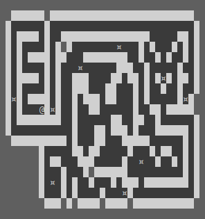
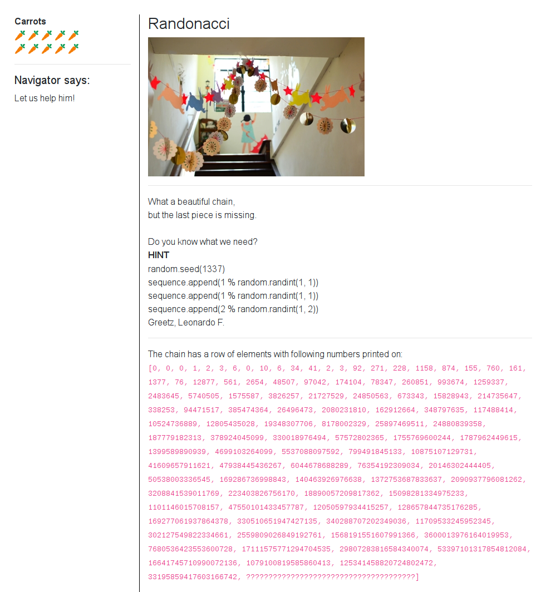
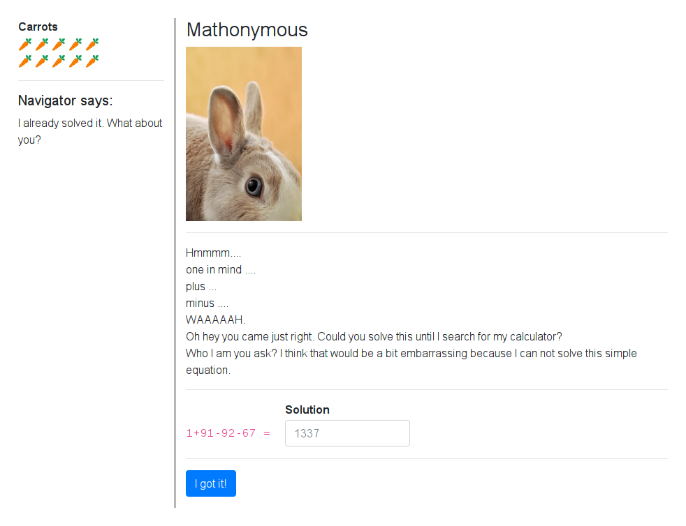
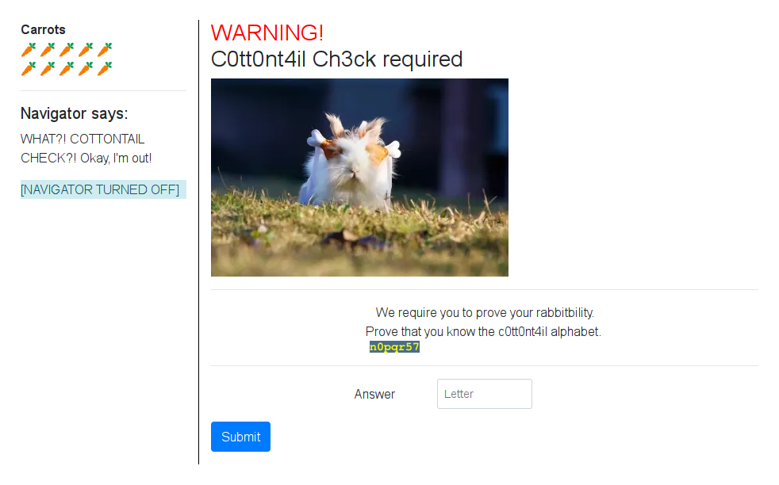
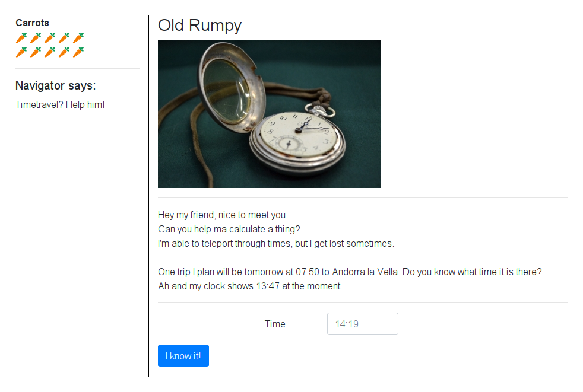
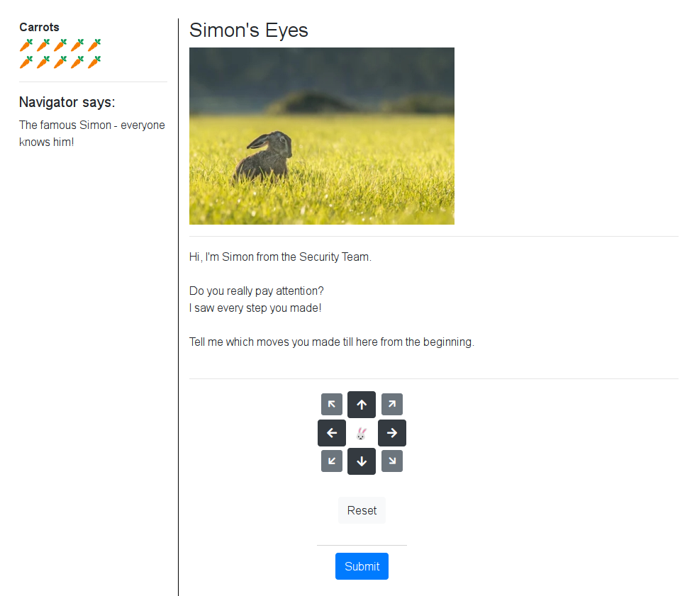
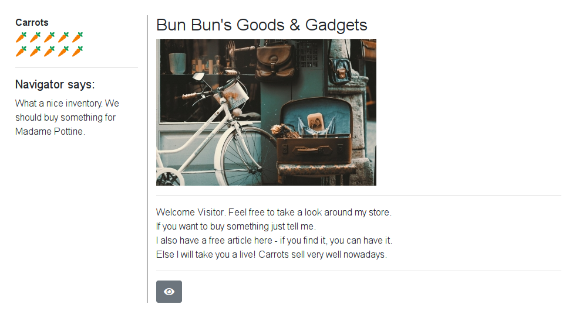
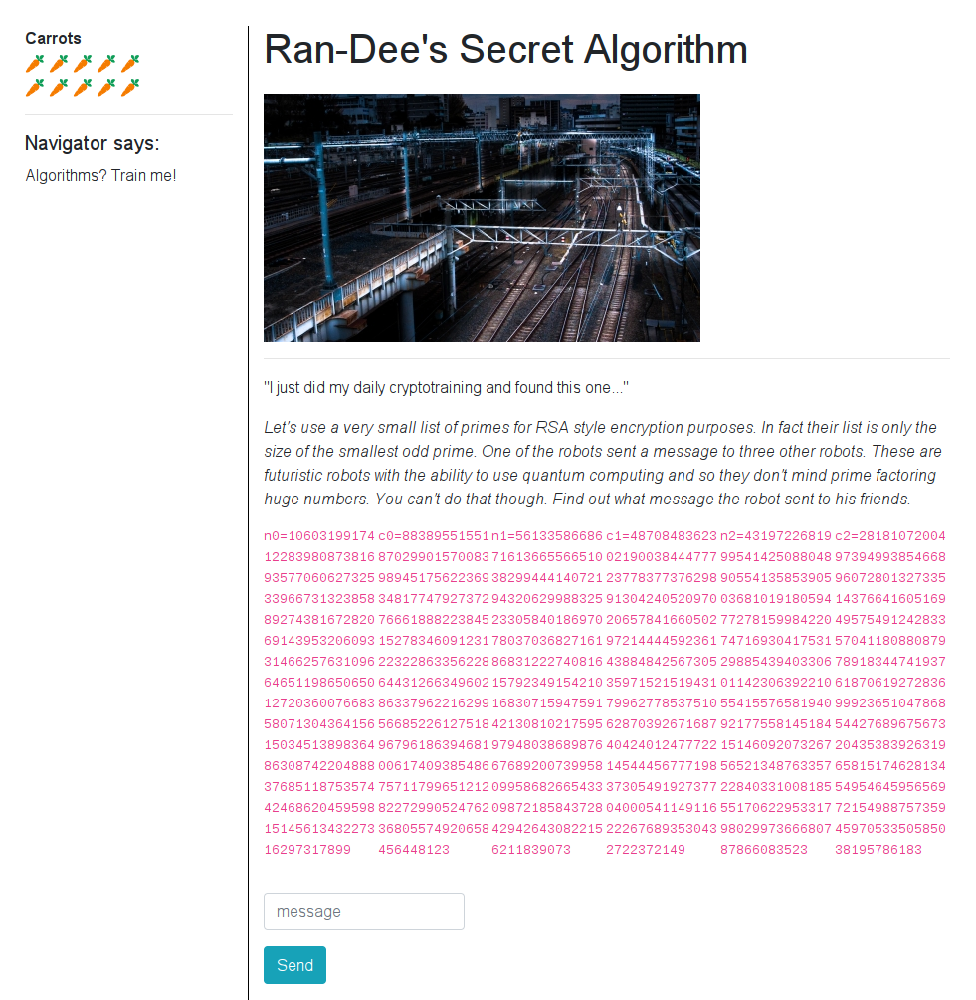
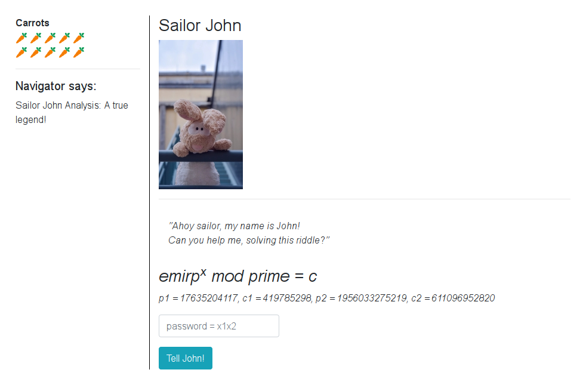
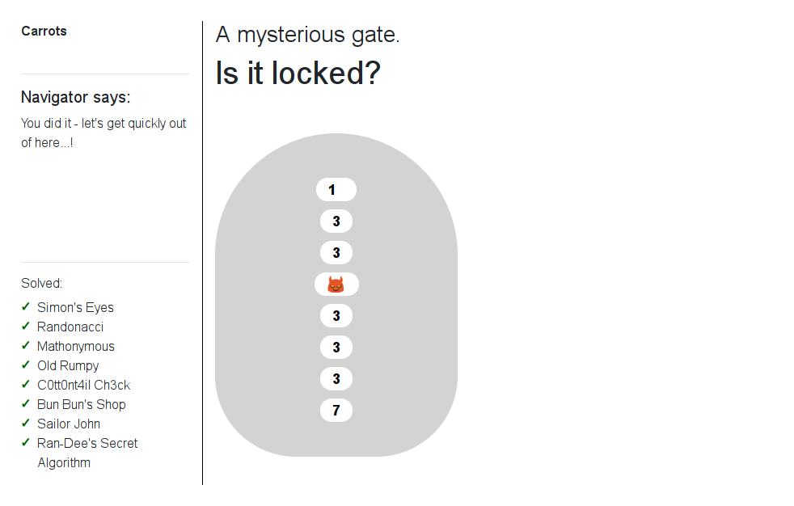

# 22 - The Hunt: Muddy Quagmire

Welcome to the longest scavenger hunt of the world!

The hunt is divided into two parts, each of which will give you an Easter egg. Part 2 is the **Muddy Quagmire**.

To get the Easter egg, you have to fight your way through a maze. On your journey, find and solve **9** mini challenges, then go to the exit. Make sure to check your carrot supply! Wrong submissions cost one carrot each.

[Start the hunt](http://whale.hacking-lab.com:5337/)

### Description

The target site provided me these simple instructions:

> *Click the buttons on the left to get some basic help.* 
>
> *What you are seeing is your navigator interface. This is the only option to interact with the environment. Since we are in an early stage of this new feature, we can't provide you any graphical interface right now. But you are smart (this is why you choosed us!) and will figure it out quickly.*
> 
> *You got it. What would be an exciting trip without the option to move and visit all the nice places we promised you?*
> 
> ``` ``bqq`vsm``0npwf0y0z ```
> 
> *You might meet other visitor during your travel. Some really take a lot of time in there to see our whole effort in detail.*
>  
> *But I promise - everyone is nice in there and will love to meet you! 😈*

### Solution

To explore the maze I reused The Hunt Maze [client](../../src/main/scala/hackyeaster2019/tools/TheHuntMaze.scala) I wrote for the first part of The Hunt: [Misty Jungle](../egg21/README.md). This time the maze was just a single stage containing all 9 mini challenges.

Here is an ASCII version of the map. Starting position is marked by `@` and position of the mini challenges by `¤` character.



#### Randonacci



The reference to the [Fibonacci sequence](https://en.wikipedia.org/wiki/Fibonacci_number) was obvious so it was quite easy to understand what was this challenge about. I wrote my [Randonacci sequence](files/randonacci/solve.py) implementation in Python.

```python
import random
from functools import lru_cache

random.seed(1337)

@lru_cache(100)
def fibonacci(n):
    if n <= 1:
        return 1
    return fibonacci(n - 1) + fibonacci(n - 2)

def fibonacci_seq(n):
    return [ fibonacci(i) for i in range(n) ]

def randonacci(n):
    return n % random.randint(1, n)

randonacci_seq = list(map(randonacci, fibonacci_seq(103)))

print(randonacci_seq[-1])
```

The result: `117780214897213996119`

#### Mathonymous



I simply evaluated the given math expression using python.

```
$ python -c "print 1+91-92-67"
-67
```

#### C0tt0nt4il Ch3ck



The small image with the yellow text was quickly moving from side to side which made it unreadable. I stopped the JS timer which moved the image in DevTools. Then I could read the text: `bcd3f6h`.

It was a leetspeak alphabet sequence starting with `n` and ending with `t`. To solve the challenge I had to enter the next letter from the sequence.

The answer: `u`

#### Old Rumpy



Since it was `15:47` in my time zone (`UTC+2:00`) I knew his timezone was `UTC+0:00`. Andorra la Vella was in `UTC+2:00` time zone so I simply added 2 hours to the time of his trip.

The time: `09:50`

#### Simon's Eyes



I had my ASCII map of the maze so it was easy to just convert the path with this Scala script.

```scala
def solve(): Array[Char] = "aaawwdddwwaaawwdddwwaaaaassssssssssddddddddddwwwwwwdd".map {
  case 'w' => '1'
  case 's' => '6'
  case 'a' => '3'
  case 'd' => '4'
}.toCharArray
```

The result array:

```javascript
["3","3","3","1","1","4","4","4","1","1","3","3","3","1","1","4","4","4","1","1","3","3","3","3","3","6","6","6","6","6","6","6","6","6","6","4","4","4","4","4","4","4","4","4","4","1","1","1","1","1","1","4","4"];
```

#### Bun Bun's Goods & Gadgets



I clicked the watch button which triggered series of redirects. I inspected them in DevTools. They differed only in the following headers: `Content-Type`, `Set-Cookie` and `WhatYouHear`.

```
Content-Type: shop/gun
WhatYouHear: Not a fan of this?

Content-Type: shop/wood
WhatYouHear: No haste

Content-Type: shop/hammer
WhatYouHear: Want this?

... (snip) ...

Content-Type: shop/teabag
WhatYouHear: Nothing for you?
``` 

Navigator suggested that I should buy something for Madame Pottine. It was a clear clue on how to identify the right item, the teabag. I copied cookie the value from the `Set-Cookie` header of the request with `Content-Type: shop/teabag`, set it via DevTools and clicked the buy button.

#### Ran-Dee's Secret Algorithm



I had to decrypt one of the encrypted messages `c0`, `c1`, `c2` knowing the modulus values `n0`, `n1`, `n2`. Normally, I would have to factorize the modulus values, but since only 3 (i.e. the size of the smallest odd prime) unique primes were used I could find those factors easily using GCD algorithm. 

```scala
val n0 = BigInt("5613358668671613665566510382994441407219432062998832523305840186970780370368271618683122274081615792349154210168307159475914213081021759597948038689876676892007399580995868266543309872185843728429426430822156211839073")
val n1 = BigInt("43197226819995414250880489055413585390503681019180594772781599842207471693041753129885439403306011423063922105541557658194092177558145184151460920732675652134876335722840331008185551706229533179802997366680787866083523")
val n2 = BigInt("10603199174122839808738169357706062732533966731323858892743816728206914395320609331466257631096646511986506501272036007668358071304364156150345138983648630874220488837685118753574424686204595981514561343227316297317899")

val c0 = BigInt("4870848362302190038444777237783773762989130424052097020657841660502972144445923614388484256730535971521519431799627785375106287039267168740424012477722145444567771983730549192737704000541149116222676893530432722372149")
val c1 = BigInt("28181072004973949938546689607280132733514376641605169495754912428335704118088087978918344741937618706192728369992365104786854427689675673204353839263196581517462813454954645956569721549887573594597053350585038195786183")
val c2 = BigInt("883895515518702990157008398945175622369348177479273727666188822384515278346091231223228633562286443126634960286337962216299566852261275189679618639468100617409385486757117996512128227299052476236805574920658456448123")

// find factors
val f0 = gcd(n0, n1)
val f1 = gcd(n0, n2)
val f2 = gcd(n1, n2)

assert(n0 == f0 * f1)
assert(n1 == f0 * f2)
assert(n2 == f1 * f2) 
```

Assertions were met so I added my implementation of the RSA decryption function.

```scala
def decrypt(ciphertext: BigInt, factors: (BigInt, BigInt), e: BigInt): String = {
  val p = factors._1
  val q = factors._2
  val n = p * q

  // calculate phi
  val phi = lcm(p - 1, q - 1)
  assert(e.gcd(phi) == 1, "e and phi are not coprimes")

  // d * e ≡ 1 (mod phi)
  val d = e.modInverse(phi)
  assert((d * e).mod(phi).equals(1), "d is not e inverted")

  ascii(ciphertext.modPow(d, n).toByteArray)
}
```

The last thing was to guess the value of public exponent `e`. I used the most common value `65537` which worked as expected.

```scala
val message = decrypt(c0, (f0, f1), 65537)
```

The comple source code of my solver can be found [here](../../src/main/scala/hackyeaster2019/Egg22RanDee.scala).

The decrypted message: `RSA3ncrypt!onw!llneverd!e`

#### Sailor John



You got two tuples of a prime number and a constant `(p1, c1)` and `(p2, c2)`. For each of those you had to solve the equation `emirp ^ x ≡ c (mod prime)` to get the values `x1` and `x2`. `emirp` was just the `prime` number with digits in reversed order.

I used this online [Discrete logarithm calculator](https://www.alpertron.com.ar/DILOG.HTM) to solve the equation.

1. prime = 17635204117, c = 419785298 ⇒ emirp = 71140253671

   `x1 = 1647592057 + 4408801029 · k, for k ∈ Z`

2. prime = 1956033275219, c = 611096952820 ⇒ emirp = 9125723306591

   `x2 = 305768189495 + 978016637609 · k, for k ∈ Z`

I picked k = 0:

```
x1 = 1647592057  
x2 = 305768189495
```

Then I followed given hint `password = x1x2`, i.e. string concatenation of `x1` and `x2` values. To make it work I had to convert those values to hex first.

```
hex(x1) = 0x62344279
hex(x2) = 0x4731344E37
solution = ascii(concat(hex(x1), hex(x2)))
         = ascii(0x623442794731344E37)
         = b4ByG14N7
```

The result: `b4ByG14N7`

#### A mysterious gate



This was the final mini challenge of this level. To solve it you had to find the right combination to open the lock.

As the first thing I had to understand this JavaScript responsible for opening the lock to reveal the flag in case the right combination was entered. I added few comments to the code to sum up my observations. 

```javascript
function h(s) {
    return s.split("").reduce(function (a, b) {
        a = ((a << 5) - a) + b.charCodeAt(0); // a = a * 31 + b
        return a & a
    }, 0);
}

var ca = function (str, amount) { // ROT-n
    if (Number(amount) < 0)
        return ca(str, Number(amount) + 26);
    var output = '';
    for (var i = 0; i < str.length; i++) {
        var c = str[i];
        if (c.match(/[a-z]/i)) {
            var code = str.charCodeAt(i);
            if ((code >= 65) && (code <= 90))
                c = String.fromCharCode(((code - 65 + Number(amount)) % 26) + 65);
            else if ((code >= 97) && (code <= 122))
                c = String.fromCharCode(((code - 97 + Number(amount)) % 26) + 97);
        }
        output += c;
    }
    return output;

};

$('.door').click(function () {
    var n = [
        $('#n1').val(),
        $('#n2').val(),
        $('#n3').val(),
        $('#n4').val(),
        $('#n5').val(),
        $('#n6').val(),
        $('#n7').val(),
        $('#n8').val()
    ];

    var g = 'Um';
    var et = 'iT';
    var lo = 'BG';
    var st = '4I';

    var into = 'xr';
    var the = 'Xp';
    var lab = 'rr';
    var hahaha = 'Qv';

    var ok = ca('mj19', -5) + '<br>' +
        ca(et, n[0]) +
        ca(the, n[1]) + '<br>' +
        ca(g, n[2]) +
        ca(lo, n[3]) + '<br>' +
        ca(st, n[4]) +
        ca(hahaha, n[5]) + '<br>' +
        ca(into, n[6]) +
        ca(lab, n[7]);

    $('#key').html(ok);

    if (h(n.join('')) === -502491864) {
        $('.door').toggleClass('what');
    }
});
```

The code looked clear enough so I directly wrote my Scala [bruteforce solver](../../src/main/scala/hackyeaster2019/Egg22MysteriousGate.scala) to find the right combination of lock pins.

```scala
def h(s: String): Int = s.foldLeft(0)((a, b) => a * 31 + b)

def bruteforce(): Option[Array[Int]] = {
  val range = -9 to 9

  for (n0 <- range; n1 <- range; n2 <- range; n3 <- range; n4 <- range; n5 <- range; n6 <- range; n7 <- range) {
    val s = s"$n0$n1$n2$n3$n4$n5$n6$n7"
    if (h(s) == -502491864) {
      return Some(Array(n0, n1, n2, n3, n4, n5, n6, n7))
    }
  }

  None
}

bruteforce().foreach(pins => println(s"pins: ${pins.mkString(", ")}"))
```

This was the result:

```
pins: -9, 2, 4, 8, 6, 6, 3, 1
```

Lock successfully opened and showed the flag. 

### Flag

```
he19-zKZr-YqJO-4OWb-auss
```
