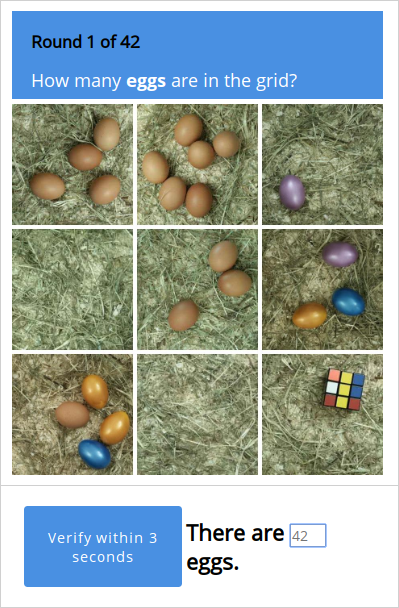
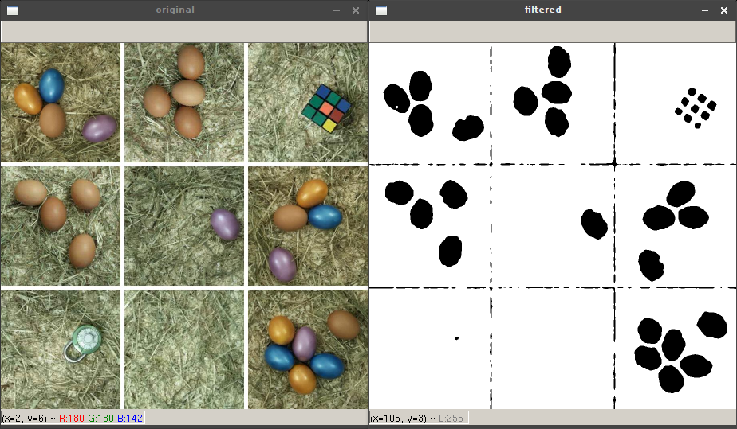
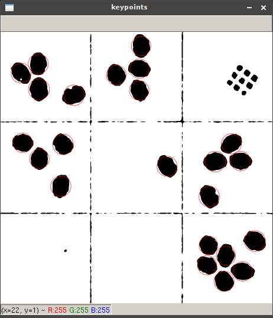

# 24 - CAPTEG

CAPTEG - Completely Automated Turing test to know how many Eggs are in the Grid.

CAPTEG is almost like a CAPTCHA. But here, you have to proof you are a bot that can count the eggs in the grid quickly. Bumper also wanna train his AI for finding eggs faster and faster ;)

[CAPTEG page](http://whale.hacking-lab.com:3555/)

No Easter egg here. Enter the flag directly on the flag page.

### Description

The description of the challenge said it all. The page served a 3x3 grid of images at a time. Most of the images contained eggs but there were some distractions objects as well. You had 7 seconds to count the eggs and submit the result. To successfully pass this challenge you had to submit 42 correct results in a row.



### Solution

I decided to build my CAPTEG solver on top of [OpenCV](https://opencv.org/), an open source computer vision and machine learning library. I started looking for the right sequence of image filters to convert the original colorful image into a binary black&white image suitable for blob detection. I ended up with the following Python script combining a blur with two threshold filters. 

```python
import os
import sys
import cv2 as cv

def filter_image(image_file):
    original = cv.imread(image_file, cv.IMREAD_COLOR)

    show_image(original, 'original')

    grayscale = cv.imread(image_file, cv.IMREAD_GRAYSCALE)

    filtered = cv.adaptiveThreshold(grayscale, 255, cv.ADAPTIVE_THRESH_GAUSSIAN_C, cv.THRESH_BINARY_INV, 7, 4)
    filtered = cv.GaussianBlur(filtered, (21, 21), 0)
    _, filtered = cv.threshold(filtered, 40, 255, cv.THRESH_BINARY)

    show_image(filtered, 'filtered')

def show_image(image, title):
    resized_width = int(image.shape[1] * 0.5)
    resized_height = int(image.shape[0] * 0.5)
    resized = cv.resize(image, (resized_width, resized_height), interpolation = cv.INTER_AREA)

    cv.imshow(title, resized)

img_file = sys.argv[1]

if not os.path.isfile(img_file):
    print(img_file + ' is not a file!')
    exit(-1)

filter_image(img_file)

cv.waitKey()
```

The result looked good enough.

```
$ ./filter_image.py input.jpg
```



Then I used [SimpleBlobDetector](https://www.learnopencv.com/blob-detection-using-opencv-python-c/) to calculate the total number eggs in the grid.

```python
import os
import sys
import cv2 as cv
import numpy as np

def count_eggs(image_file, show_keypoints = False):
    filtered = filter_image(image_file)

    # setup blob detector parameters
    params = cv.SimpleBlobDetector_Params()
    params.filterByColor = True
    params.blobColor = 0
    params.filterByConvexity = False
    params.filterByInertia = True
    params.minInertiaRatio = 0.4
    params.filterByArea = True
    params.minArea = 1500
    params.maxArea = 5000
    params.filterByCircularity = False

    # detect blobs
    detector = cv.SimpleBlobDetector_create(params)
    keypoints = detector.detect(filtered)

    # show keypoints
    if show_keypoints:
        img_with_keypoints = cv.drawKeypoints(filtered, keypoints, np.array([]), (0, 0, 255), cv.DRAW_MATCHES_FLAGS_DRAW_RICH_KEYPOINTS)
        show_image(img_with_keypoints, 'keypoints')

    return len(keypoints)

def filter_image(image_file):
    grayscale = cv.imread(image_file, cv.IMREAD_GRAYSCALE)

    filtered = cv.adaptiveThreshold(grayscale, 255, cv.ADAPTIVE_THRESH_GAUSSIAN_C, cv.THRESH_BINARY_INV, 7, 4)
    filtered = cv.GaussianBlur(filtered, (21, 21), 0)
    _, filtered = cv.threshold(filtered, 40, 255, cv.THRESH_BINARY)

    return filtered

def show_image(image, title):
    resized_width = int(image.shape[1] * 0.5)
    resized_height = int(image.shape[0] * 0.5)
    resized = cv.resize(image, (resized_width, resized_height), interpolation = cv.INTER_AREA)

    cv.imshow(title, resized)

img_file = sys.argv[1]

if not os.path.isfile(img_file):
    print(img_file + ' is not a file!')
    exit(-1)

show_img = len(sys.argv) > 2 and sys.argv[2] == 'show'

eggs = count_eggs(img_file, show_img)
print(eggs)

cv.waitKey()
```

It took a while until I fine-tuned all the necessary parameters, but in the end I was pleasantly surprised how well the detection worked.

```
$ ./count_eggs.py input.jpg show
23
```



As the last step I wrote a Bash script to automate fetching the image, counting the eggs and submitting the result. Although the detection was pretty accurate It was not enough to score 42 correct results in a row. To overcome this issue I had to switch to semiautomatic mode with manual correction of miscounted eggs.

```bash
#!/bin/bash

while true; do
    wget http://whale.hacking-lab.com:3555/ --load-cookies cookies.txt --save-cookies cookies.txt --keep-session-cookies -O /dev/null 2>/dev/null
    wget http://whale.hacking-lab.com:3555/picture --load-cookies cookies.txt -O capteg-input.jpg 2>/dev/null

    found=$(./count_eggs.py capteg-input.jpg show)
    echo "Found: ${found}"

    echo -n "Correction: "
    read correction

    total=$(($found + $correction))
    echo "Total: ${total}"

    response=$(wget http://whale.hacking-lab.com:3555/verify --load-cookies cookies.txt --post-data "s=${total}" -O - 2>/dev/null)
    echo "Response: ${response}"
done
```

### Flag

```
he19-s7Jj-mO4C-rP13-ySsJ
```
