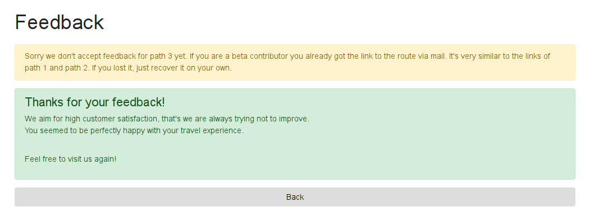
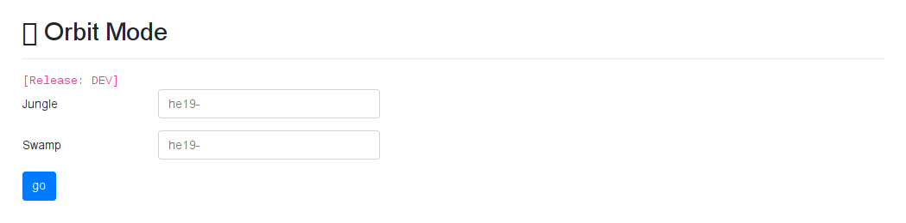
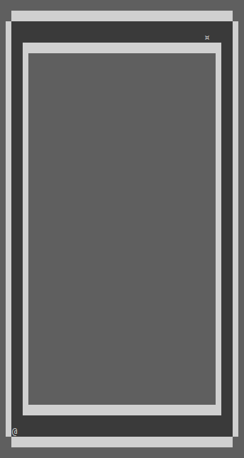
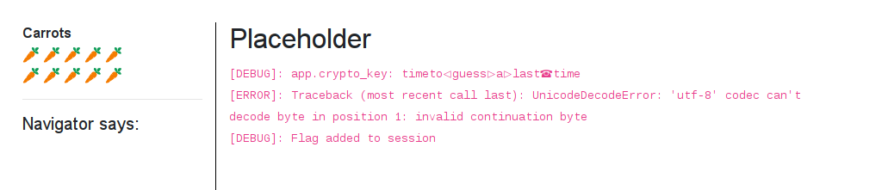

# 27 - Hidden Egg 3

Sometimes, there is a hidden bonus level.

### Solution

The entry-point of this hidden challenge was the [feedback section](http://whale.hacking-lab.com:5337/feedback) of The Hunt website which mentioned an upcoming level called *Orbit*.


I used DevTools in my browser to enable the third option and tried to submit rating of the *Orbit* level. This was the response to my attempt.



I learned that the path of the third level is similar to the links of the previous levels. As the next step I used [HashKiller](https://hashkiller.co.uk/Cracker) to crack the previous path hashes. 

```
1804161a0dabfdcd26f7370136e0f766 = MD5("P4TH1")
7fde33818c41a1089088aa35b301afd9 = MD5("P4TH2")
```

I simply calculated hash path of the third level as MD5 hash of `P4TH3`.
 
```
bf42fa858de6db17c6daa54c4d912230 = MD5("P4TH3")
``` 

Then I visited page of the [Orbit level](http://whale.hacking-lab.com:5337/bf42fa858de6db17c6daa54c4d912230).



I entered the flags, submitted the form and ... nothing happened. So I tried to enter them in reversed order which worked for some reason. I guess it was an intentional bug in the form since the level was still in development.

After successfully submitting the form I found myself in another maze. I once again reused The Hunt Maze [client](../../src/main/scala/hackyeaster2019/tools/TheHuntMaze.scala) with one simple modification - a new rule for the wall detection mechanism.

Here is an ASCII version of the map. Starting position is marked by `@` and position of the challenge by `¤` character.



#### Placeholder



This was the only mini challenge of this level. To solve it you had to decrypt your session cookie and extract the flag from it.

I searched for Werkzeug encrypted session cookie which brought me to the [EncryptedSession](https://github.com/SaintFlipper/EncryptedSession) repository. It internally used AES in EAX mode to provide session data encryption. 

Then I extracted the `crypto_key` using hexedit and wrote my Python [decryptor](files/placeholder/decrypt.py) based on the source code of [encrypted_session.py](https://github.com/SaintFlipper/EncryptedSession/blob/master/encrypted_session.py).

```python
from Crypto.Cipher import AES
import base64

# the session cookie
session_cookie = 'u.P9Esvw1OEjw4xlJpDKMM5Rv4YFQmeigTfcfEwCgkT7NuU5vtwWbHFhcLPr5isrmQ7+FIndJifnGkBMxuqtBaiuyBKV2xRzVEDAY3DjX7RBL9UI/1CnH9CMyDQfolOxX2A2Qnr0yS9u1XGXf85qim8gOrYY9Z4SNVUMJNKXac5Sn4kFX/Gu/z8wXOQ45WZLtK5QQ5jk9ci+H7Sogb9UvC+r3mBUzZHR2KMtIXSQjh3U8jw9KxV/RGbXHgEHPZe0RiQDtlOgtzrJFrBCdUBjmMCKiQPF2VAfEstYiclbpz1W+sfvwpmYQohWyQvdW57Gh1jcG+xF5NHtc3VYFjKlKBCLZeR01b/ipDKj3hvw6pElxeX3VcbiPHwrdxR3y6DWCUHUffSbqr3WsFyPgGXpc7TLABvyZGfcFwf81Z9NSB+XZxbWhmSYCOfojxyMeRsV99iVknac96aEQILKn9HzcJmpNCyn75pUss5TO0KRwJqBgNC3QQqaCL9f9QzDWE6xD9nOPD2Rg0/oK1RRWthrngSzkA7IUkCAHpHWDAZNkK6oWAIdbzjJqEVUdOEDCkWUnt7kQy1uXDFqFg6MTf9OGI/XEPRW1oypfKzgQIVc3rY4g4QGmwQU92QY6DHRwgv/R3cP3uVoQRzCtQKzaY6TC3vJ/qz0rUTvTe/7obN0rVY3SiR/y68Bu+lQ==.9K7QrLGMo7nLkHV1dGMH+A==.TDC4F2T6wABJ5+Xu+2EdHw=='

# the crypto key
crypto_key = '\x74\x69\x6D\x65\x74\x6F\x01\x67\x75\x65\x73\x73\x03\x61\x03\x6C\x61\x73\x74\x07\x74\x69\x6D\x65'

# split the session cookie : <z|u>.<base64 cipher text>.<base64 mac>.<base64 nonce>
parts = session_cookie.split('.')

# decode the cookie parts from base64
ciphertext = base64.b64decode(bytes(parts[1]))
mac = base64.b64decode(bytes(parts[2]))
nonce = base64.b64decode(bytes(parts[3]))

# decrypt data
cipher = AES.new(crypto_key, AES.MODE_EAX, nonce)
data = cipher.decrypt_and_verify(ciphertext, mac)

print(str(data))
```

I ran the decryptor and got the session data in JSON format.

```json
{
    ...
    "hidden_flag": "he19-fmRW-T6Oj-uNoT-dzOm",
    "credit": "thanks for playing! gz opasieben & ccrypto :)"
    ...
}
```

### Flag

```
he19-fmRW-T6Oj-uNoT-dzOm
```
